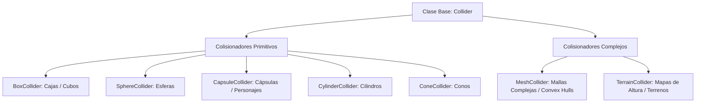
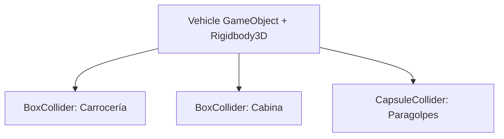

# 📐 Colliders (Primitivas, Mesh, Terreno) en Prowl Engine

Un **Collider** define el volumen geométrico de colisión de un `GameObject`. Mientras que el `MeshRenderer` determina el aspecto visual visible de una entidad, el `Collider` determina su superficie física impenetrable ante la simulación de **Jitter Physics 2**.

---

## 📦 Tipos de Colisionadores Disponibles



### 1. Colisionadores Primitivos (Máximo Rendimiento)
Las formas primitivas son evaluadas analíticamente por la CPU mediante fórmulas matemáticas directas (separación de ejes SAT, GJK y EPA). Tienen un coste computacional prácticamente despreciable:
- **[`BoxCollider`](file:///c:/Users/SaidR/Documents/GitHub/ProwlStar/Prowl.Runtime/Components/Physics/Colliders/BoxCollider.cs):** Definido por `Size` (dimensiones X, Y, Z) y un desplazamiento `Center`.
- **[`SphereCollider`](file:///c:/Users/SaidR/Documents/GitHub/ProwlStar/Prowl.Runtime/Components/Physics/Colliders/SphereCollider.cs):** Definido por su `Radius`. Es el colisionador más rápido de todo el motor.
- **[`CapsuleCollider`](file:///c:/Users/SaidR/Documents/GitHub/ProwlStar/Prowl.Runtime/Components/Physics/Colliders/CapsuleCollider.cs):** Definido por `Radius` y `Height`. Esencial para cuerpos bípedos que necesitan deslizarse suavemente por desniveles y escalones.
- **[`CylinderCollider`](file:///c:/Users/SaidR/Documents/GitHub/ProwlStar/Prowl.Runtime/Components/Physics/Colliders/CylinderCollider.cs):** Cilindros perfectos para barriles, columnas y ruedas.
- **[`ConeCollider`](file:///c:/Users/SaidR/Documents/GitHub/ProwlStar/Prowl.Runtime/Components/Physics/Colliders/ConeCollider.cs):** Conos truncados o puntiagudos para proyectiles y sensores direccionales.

---

### 2. [`MeshCollider`](file:///c:/Users/SaidR/Documents/GitHub/ProwlStar/Prowl.Runtime/Components/Physics/Colliders/MeshCollider.cs) (Mallas Arbitrarias)
Permite utilizar la geometría exacta de un modelo 3D ([`Mesh`](file:///c:/Users/SaidR/Documents/GitHub/ProwlStar/Prowl.Runtime/Resources/Mesh.cs)) como superficie de colisión.

Existen dos modos de operación críticos:
1. **Modo Estático / Triangle Mesh (`Convex = false`):**
   - La malla puede ser cóncava y contener huecos interiores (habitaciones, cuevas, puentes).
   - **Restricción:** Solo puede usarse en objetos **estáticos** o cinemáticos. Los cuerpos dinámicos libres no pueden usar mallas cóncavas debido a la complejidad computacional infinita de resolver dos mallas cóncavas entre sí.
2. **Modo Convexo (`Convex = true`):**
   - Jitter 2 calcula automáticamente la envoltura convexa (*Convex Hull*) de la malla, cubriendo cualquier concavidad como si estuviera envuelta en papel film.
   - **Permitido en Rigidbody3D dinámicos:** Puede rodar, caer y chocar libremente.

---

### 3. [`TerrainCollider`](file:///c:/Users/SaidR/Documents/GitHub/ProwlStar/Prowl.Runtime/Components/Physics/TerrainCollider.cs) (Terrenos de Altura)
Optimizado específicamente para paisajes abiertos y campos de altura (*Heightfields*):
- En lugar de almacenar millones de triángulos en memoria, almacena una matriz 2D de alturas interpoladas.
- Las colisiones se resuelven en tiempo constante $O(1)$ proyectando la posición del objeto directamente sobre la celda de la cuadrícula correspondiente.

---

## 🧲 Colisionadores Compuestos (Compound Colliders)

Para representar objetos de forma compleja (por ejemplo, una mesa con cuatro patas y una tabla superior, o una nave espacial con alas y fuselaje) manteniendo el rendimiento máximo:



En Prowl:
- Coloca un único `Rigidbody3D` en el `GameObject` raíz.
- Añade múltiples `Collider` primitivos en el mismo objeto o en sus hijos.
- **Jitter 2 los fusionará automáticamente en un único cuerpo rígido compuesto**, calculando de forma precisa el centro de masas colectivo y el tensor de inercia unificado sin el coste de un `MeshCollider`.

---

## 🚪 Volúmenes de Disparo (TriggerVolume)

Si deseas detectar cuándo un objeto entra en una zona (por ejemplo, el área de apertura de una puerta, un punto de control o una trampa de pinchos) sin que los objetos reboten físicamente:

Utiliza el componente [`TriggerVolume`](file:///c:/Users/SaidR/Documents/GitHub/ProwlStar/Prowl.Runtime/Components/Physics/TriggerVolume.cs):
```csharp
using Prowl.Runtime;

public class CheckpointZone : MonoBehaviour
{
    public override void OnTriggerEnter(Rigidbody3D other)
    {
        base.OnTriggerEnter(other);
        if (other.CompareTag("Player"))
        {
            Debug.Log("Punto de control alcanzado.");
        }
    }
}
```

---

## 🔗 Temas Relacionados
- Configuración de física: [[🌍 PhysicsWorld y Configuración]].
- Movimiento y fuerzas: [[🧊 Rigidbodies y Modos de Fuerza]].
- Consultas de rayos: [[🎯 Raycasting y Shape Queries]].
