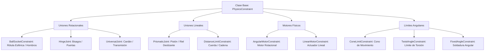

# 🔗 Joints y Restricciones (Constraints) en Prowl Engine

Las restricciones físicas o **Joints** conectan dos cuerpos rígidos ([`Rigidbody3D`](file:///c:/Users/SaidR/Documents/GitHub/ProwlStar/Prowl.Runtime/Components/Physics/Rigidbody3D.cs)) o anclan un cuerpo rígido al mundo estático, restringiendo ciertos grados de libertad de traslación o rotación.

En Prowl Engine, la suite de restricciones físicas está implementada sobre el motor de resolución analítico de **Jitter Physics 2** ([`PhysicsConstraint.cs`](file:///c:/Users/SaidR/Documents/GitHub/ProwlStar/Prowl.Runtime/Components/Physics/Constraints/PhysicsConstraint.cs)), permitiendo crear desde puertas giratorias, pistones y cuerdas hasta esqueletos de muñeco de trapo (**Ragdolls**) y maquinaria industrial compleja.

---

## 🛠️ Catálogo Completo de Joints y Restricciones



---

## 📋 Descripción de Componentes Principales

### 1. [`BallSocketConstraint`](file:///c:/Users/SaidR/Documents/GitHub/ProwlStar/Prowl.Runtime/Components/Physics/Constraints/BallSocketConstraint.cs) (Rótula Esférica)
- Bloquea los 3 grados de libertad de traslación en el punto de anclaje, pero deja libres los 3 ejes de rotación.
- Emula articulaciones orgánicas como hombros y caderas en personajes físicos (*Ragdolls*).

### 2. [`HingeJoint`](file:///c:/Users/SaidR/Documents/GitHub/ProwlStar/Prowl.Runtime/Components/Physics/Constraints/HingeJoint.cs) (Bisagra)
- Permite la rotación únicamente alrededor de un eje específico (e.g. el eje vertical Y para una puerta).
- Parámetros: `Axis`, `Anchor`, `UseLimits` (límites angulares mínimo y máximo) y `Spring/Damper` (resorte de retorno).

### 3. [`PrismaticJoint`](file:///c:/Users/SaidR/Documents/GitHub/ProwlStar/Prowl.Runtime/Components/Physics/Constraints/PrismaticJoint.cs) (Pistón Lineal)
- Permite el desplazamiento a lo largo de una única línea recta fija en el espacio, bloqueando todas las rotaciones y desplazamientos perpendiculares.
- Ideal para amortiguadores de suspensión, ascensores mecánicos y cajones deslizantes.

### 4. [`DistanceLimitConstraint`](file:///c:/Users/SaidR/Documents/GitHub/ProwlStar/Prowl.Runtime/Components/Physics/Constraints/DistanceLimitConstraint.cs) (Cuerda / Límite de Distancia)
- Restringe la distancia máxima y/o mínima permitida entre dos puntos de anclaje.
- Si la distancia supera el límite, aplica un impulso elástico o inelástico correctivo. Excelente para simular cables de grúa, lianas y anclas.

### 5. [`AngularMotorConstraint`](file:///c:/Users/SaidR/Documents/GitHub/ProwlStar/Prowl.Runtime/Components/Physics/Constraints/AngularMotorConstraint.cs) (Motor de Giro)
- Aplica torque continuo para alcanzar y mantener una velocidad angular objetivo (`TargetVelocity`) hasta un torque máximo (`MaxTorque`).
- Utilizado para hélices de helicóptero, ruedas de vehículos impulsadas por motor y engranajes.

---

## 💻 Ejemplo: Puerta Giratoria Interactiva con HingeJoint

```csharp
using Prowl.Runtime;
using Prowl.Vector;

public class InteractiveDoor : MonoBehaviour
{
    private HingeJoint _hinge;
    private Rigidbody3D _doorRb;

    public override void Awake()
    {
        base.Awake();

        _doorRb = GetComponent<Rigidbody3D>();
        _hinge = AddComponent<HingeJoint>();

        // Anclar la bisagra en el marco lateral de la puerta
        _hinge.Anchor = new Float3(-0.9f, 0, 0);

        // Eje de giro vertical
        _hinge.Axis = Float3.Up;

        // Si ConnectedBody es null, la puerta se ancla rígidamente al mundo estático
        _hinge.ConnectedBody = null;
    }

    public void PushDoor()
    {
        // Empujar la puerta aplicando una fuerza física en la manilla
        _doorRb.AddForceAtPosition(Transform.Forward * 15f, Transform.Position + new Float3(0.8f, 0, 0), ForceMode.Impulse);
    }
}
```

---

## ⚡ Estabilidad en Cadenas de Restricciones
- **Masa Relativa:** Evita conectar cuerpos con relaciones de masa extremas (por ejemplo, un cuerpo de 1 kg conectado a uno de 10,000 kg). Mantén la proporción dentro de un rango de $1:10$ para evitar vibraciones numéricas.
- **Paso Fijo (FixedDeltaTime):** Si diseñas mecanismos con cadenas de más de 5 eslabones o ragdolls rápidos, reduce `FixedDeltaTime` a `0.01s` (100 Hz) para rigidez perfecta.

---

## 🔗 Temas Relacionados
- Dinámica de cuerpos rígidos: [[🧊 Rigidbodies y Modos de Fuerza]].
- Controlador de vehículos: [[🚗 WheelCollider y Vehículos]].
- Controlador de personajes: [[🚶 CharacterController]].
