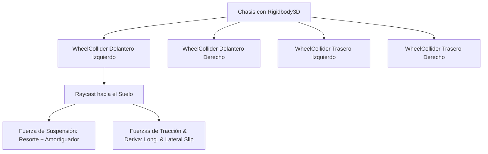

# 🚗 WheelCollider y Vehículos en Prowl Engine

Simular vehículos realistas (coches deportivos, camiones, buggies todoterreno) mediante colisionadores cilíndricos estándar genera inestabilidad, rebotes numéricos y fricción deficiente.

Prowl Engine proporciona un componente dedicado de grado profesional: [`WheelCollider.cs`](file:///c:/Users/SaidR/Documents/GitHub/ProwlStar/Prowl.Runtime/Components/Physics/WheelCollider.cs). Funciona como una rueda basada en **raycast / shape-cast**, calculando con precisión la compresión del muelle de suspensión, la amortiguación hidráulica y las curvas de fricción longitudinal y lateral basadas en el deslizamiento (*Slip Curves*).

---

## 🏎️ Anatomía de WheelCollider



### 1. Sistema de Suspensión
- **`SuspensionDistance`:** Longitud máxima de recorrido de la suspensión en metros (p. ej. 0.3m).
- **`SpringRate` (Rigidez del Resorte):** Fuerza elástica en $N/m$ que sostiene el peso del vehículo.
- **`DamperRate` (Amortiguación):** Frena las oscilaciones para evitar que el coche rebote indefinidamente tras saltar.
- **`TargetPosition`:** Posición neutral de descanso del resorte (entre 0.0 totalmente extendido y 1.0 comprimido).

### 2. Geometría y Cinemática de la Rueda
- **`Radius`:** Radio físico de la rueda en metros.
- **`SteerAngle`:** Ángulo de giro de dirección en grados (orienta el vector de avance de la rueda).
- **`MotorTorque`:** Par motor aplicado en $N \cdot m$ para acelerar.
- **`BrakeTorque`:** Par de frenado para desacelerar o bloquear la rueda.

### 3. Modelo de Fricción por Deslizamiento (Slip)
- **Fricción Longitudinal (Forward Slip):** Calcula la diferencia entre la velocidad angular de la rueda y la velocidad lineal real del vehículo contra el asfalto. Modela la aceleración, el bloqueo por frenada brusca y el derrape en línea recta.
- **Fricción Lateral (Sideways Slip):** Mide el ángulo de deriva lateral (*Slip Angle*). Otorga el agarre en curvas y permite derrapes controlados (*Drifting*).

---

## 💻 Controlador Básico de Vehículo en C#

A continuación se muestra un controlador funcional de 4 ruedas con tracción trasera (RWD) y dirección delantera:

```csharp
using Prowl.Runtime;
using Prowl.Vector;

public class CarController : MonoBehaviour
{
    [Header("Ruedas")]
    [SerializeField] private WheelCollider _frontLeft;
    [SerializeField] private WheelCollider _frontRight;
    [SerializeField] private WheelCollider _rearLeft;
    [SerializeField] private WheelCollider _rearRight;

    [Header("Mallas Visuales")]
    [SerializeField] private Transform _frontLeftMesh;
    [SerializeField] private Transform _frontRightMesh;
    [SerializeField] private Transform _rearLeftMesh;
    [SerializeField] private Transform _rearRightMesh;

    [Header("Ajustes del Motor")]
    [SerializeField] private float _maxMotorTorque = 400f;
    [SerializeField] private float _maxSteerAngle = 30f;
    [SerializeField] private float _brakeForce = 800f;

    private float _steerInput;
    private float _throttleInput;
    private bool _braking;

    public override void Update()
    {
        base.Update();

        // Captura de entrada
        _steerInput = (Input.GetKey(Key.D) ? 1 : 0) - (Input.GetKey(Key.A) ? 1 : 0);
        _throttleInput = (Input.GetKey(Key.W) ? 1 : 0) - (Input.GetKey(Key.S) ? 1 : 0);
        _braking = Input.GetKey(Key.Space);

        // Sincronizar posición y rotación de las mallas visuales de las ruedas
        UpdateWheelVisual(_frontLeft, _frontLeftMesh);
        UpdateWheelVisual(_frontRight, _frontRightMesh);
        UpdateWheelVisual(_rearLeft, _rearLeftMesh);
        UpdateWheelVisual(_rearRight, _rearRightMesh);
    }

    public override void FixedUpdate()
    {
        base.FixedUpdate();

        // 1. Dirección en las ruedas delanteras
        float currentSteer = _steerInput * _maxSteerAngle;
        _frontLeft.SteerAngle = currentSteer;
        _frontRight.SteerAngle = currentSteer;

        // 2. Tracción trasera (RWD)
        float currentTorque = _braking ? 0f : (_throttleInput * _maxMotorTorque);
        _rearLeft.MotorTorque = currentTorque;
        _rearRight.MotorTorque = currentTorque;

        // 3. Frenado en las 4 ruedas
        float currentBrake = _braking ? _brakeForce : 0f;
        _frontLeft.BrakeTorque = currentBrake;
        _frontRight.BrakeTorque = currentBrake;
        _rearLeft.BrakeTorque = currentBrake;
        _rearRight.BrakeTorque = currentBrake;
    }

    private void UpdateWheelVisual(WheelCollider col, Transform visual)
    {
        if (col == null || visual == null) return;
        col.GetWorldPose(out Float3 pos, out Quaternion rot);
        visual.Position = pos;
        visual.Rotation = rot;
    }
}
```

---

## ⚡ Ajuste y Estabilidad
- **Centro de Masas (Center of Mass):** Un vehículo con el centro de masas alto volcará en la primera curva. Asegúrate de ajustar el centro de masas del `Rigidbody3D` hacia la parte inferior del chasis:
  ```csharp
  rb.CenterOfMass = new Float3(0, -0.4f, 0);
  ```
- **Anti-Roll Bars (Barras Estabilizadoras):** Para coches deportivos a altas velocidades, conecta una fuerza estabilizadora cruzada entre las ruedas izquierda y derecha para evitar el balanceo excesivo de la carrocería.

---

## 🔗 Temas Relacionados
- Cuerpos físicos: [[🧊 Rigidbodies y Modos de Fuerza]].
- Uniones mecánicas: [[🔗 Joints y Restricciones (Constraints)]].
- Controlador de personajes: [[🚶 CharacterController]].
