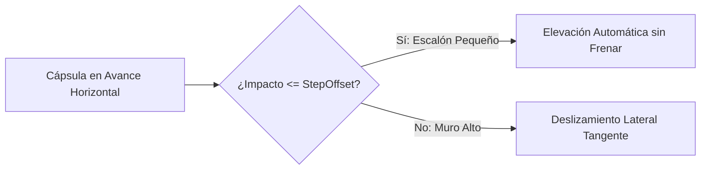

# 🚶 CharacterController en Prowl Engine

Mover a un personaje humanoide utilizando un `Rigidbody3D` puramente dinámico suele provocar problemas comunes: rebotes involuntarios al bajar rampas, atascos en escalones pequeños, rotaciones accidentales al colisionar de lado y falta de precisión en el frenado.

Para solucionar esto, Prowl Engine incluye [`CharacterController.cs`](file:///c:/Users/SaidR/Documents/GitHub/ProwlStar/Prowl.Runtime/Components/Physics/CharacterController.cs), un controlador cinemático especializado en movimiento bípedo que ignora fuerzas externas no deseadas, sube escaleras automáticamente y se desliza con suavidad a lo largo de paredes y rampas.

---

## 🏗️ Propiedades Principales de CharacterController

| Propiedad | Tipo | Descripción |
| :--- | :--- | :--- |
| `Height` | `float` | Altura total de la cápsula en metros (p. ej. 1.8m). |
| `Radius` | `float` | Radio de la cápsula (p. ej. 0.4m). |
| `Center` | `Float3` | Desplazamiento del centro de la cápsula respecto al pivote del GameObject. |
| `SlopeLimit` | `float` | Ángulo máximo de inclinación en grados que el personaje puede escalar (p. ej. 45°). |
| `StepOffset` | `float` | Altura máxima de escalones que el personaje puede subir automáticamente (p. ej. 0.3m). |
| `SkinWidth` | `float` | Margen de holgura exterior para evitar que la cápsula se encaje en vértices. |
| `IsGrounded` | `bool` | `true` si el personaje está apoyado sobre una superficie sólida transitable. |
| `Velocity` | `Float3` | Vector de velocidad real resultante tras resolver colisiones. |

---

## 🏃 Movimiento: `Move()` vs `SimpleMove()`

Prowl ofrece dos métodos para desplazar al personaje:

### 1. `Move(Float3 motion)` (Control Total)
- Desplaza al personaje por un vector relativo de movimiento ($\Delta \text{pos}$).
- **No aplica gravedad automáticamente:** Tú controlas la aceleración vertical, saltos y caídas.
- Es el método recomendado para videojuegos comerciales (permite saltos dobles, dash, gravedad variable y natación).

### 2. `SimpleMove(Float3 speed)` (Arcade Rápido)
- Recibe un vector de velocidad en metros por segundo ($m/s$).
- **Aplica gravedad automáticamente** en el eje vertical.
- Si el personaje está en el aire, no permite impulsos de salto adicionales.

---

## 💻 Controlador de Personaje Completo en C#

A continuación se presenta un controlador de primera/tercera persona listo para producción con soporte para correr, saltar y gravedad:

```csharp
using Prowl.Runtime;
using Prowl.Vector;

public class FPSController : MonoBehaviour
{
    [Header("Movimiento")]
    [SerializeField] private float _walkSpeed = 5.0f;
    [SerializeField] private float _runSpeed = 9.0f;
    [SerializeField] private float _jumpHeight = 1.8f;
    [SerializeField] private float _gravity = -19.62f;

    private CharacterController _cc;
    private Float3 _verticalVelocity;

    public override void Awake()
    {
        base.Awake();
        TryGetComponent(out _cc);
    }

    public override void Update()
    {
        base.Update();

        // 1. Detección de suelo
        bool grounded = _cc.IsGrounded;
        if (grounded && _verticalVelocity.Y < 0)
        {
            // Pequeña fuerza descendente para mantener contacto en pendientes
            _verticalVelocity.Y = -2.0f;
        }

        // 2. Captura de Input horizontal y vertical
        float inputX = (Input.GetKey(Key.D) ? 1 : 0) - (Input.GetKey(Key.A) ? 1 : 0);
        float inputZ = (Input.GetKey(Key.W) ? 1 : 0) - (Input.GetKey(Key.S) ? 1 : 0);
        bool running = Input.GetKey(Key.LeftShift);

        float currentSpeed = running ? _runSpeed : _walkSpeed;
        Float3 moveDirection = (Transform.Right * inputX) + (Transform.Forward * inputZ);

        if (moveDirection.sqrMagnitude > 1.0f)
            moveDirection = moveDirection.normalized;

        Float3 horizontalMotion = moveDirection * currentSpeed * (float)Time.deltaTime;

        // 3. Salto
        if (Input.GetKeyDown(Key.Space) && grounded)
        {
            // Fórmula física: v = sqrt(-2 * g * h)
            _verticalVelocity.Y = MathF.Sqrt(-2f * _gravity * _jumpHeight);
        }

        // 4. Aplicar gravedad acumulada
        _verticalVelocity.Y += _gravity * (float)Time.deltaTime;

        // 5. Ejecutar desplazamiento combinado en CharacterController
        Float3 totalMotion = horizontalMotion + (_verticalVelocity * (float)Time.deltaTime);
        _cc.Move(totalMotion);
    }
}
```

---

## 🧗 Manejo de Pendientes y Escaleras (StepOffset)



- Si el personaje choca contra un escalón cuya altura es menor o igual que `StepOffset`, el controlador eleva suavemente la base de la cápsula por encima del obstáculo y continúa el avance sin perder impulso horizontal.
- Si la inclinación del suelo supera `SlopeLimit`, el personaje no podrá avanzar hacia arriba y comenzará a deslizarse hacia abajo por la rampa.

---

## 🔗 Temas Relacionados
- Input del jugador: [[🎮 Arquitectura del Input System]].
- Configuración de física: [[🌍 PhysicsWorld y Configuración]].
- Consultas de suelo: [[🎯 Raycasting y Shape Queries]].
