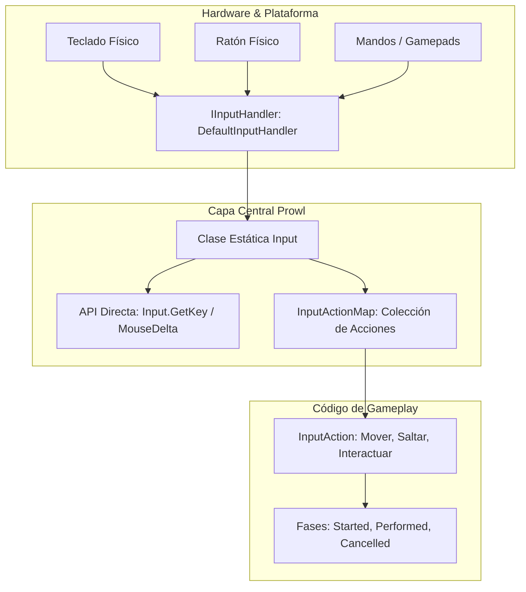

# 🎮 Arquitectura del Input System en Prowl Engine

El subsistema de entrada en **Prowl Engine** está diseñado para ofrecer dos niveles de abstracción complementarios:
1. **API Directa de Bajo Nivel (Polling):** Consultas directas de teclas, botones del ratón y posición del cursor mediante la clase estática [`Input`](file:///c:/Users/SaidR/Documents/GitHub/ProwlStar/Prowl.Runtime/InputManagement/Input.cs) (ideal para prototipos rápidos o herramientas de edición).
2. **API Desacoplada Basada en Acciones (Action-Based Input):** Inspirada en el moderno Input System de Unity, basada en [`InputActionMap`](file:///c:/Users/SaidR/Documents/GitHub/ProwlStar/Prowl.Runtime/InputManagement/InputActionMap.cs) y [`InputAction`](file:///c:/Users/SaidR/Documents/GitHub/ProwlStar/Prowl.Runtime/InputManagement/InputAction.cs), donde el código de juego reacciona a intenciones semánticas (*"Saltar"*, *"Disparar"*, *"Moverse"*) en lugar de a botones físicos de hardware (*Espacio*, *Click Izquierdo*, *WASD*).

---

## 🏗️ Pila Arquitectónica de Entrada



---

## 🕹️ 1. API Directa de Bajo Nivel (Polling)

La clase estática [`Input`](file:///c:/Users/SaidR/Documents/GitHub/ProwlStar/Prowl.Runtime/InputManagement/Input.cs) permite consultar en cualquier momento el estado actual de los periféricos:

### Teclado:
```csharp
// Comprobar si la tecla está pulsada continuamente
if (Input.GetKey(Key.W)) { ... }

// Comprobar si la tecla fue pulsada en este frame
if (Input.GetKeyDown(Key.Space)) { ... }

// Comprobar si la tecla fue liberada en este frame
if (Input.GetKeyUp(Key.Escape)) { ... }
```

### Ratón y Cursor:
```csharp
// Botones del ratón (0 = Izquierdo, 1 = Derecho, 2 = Central)
if (Input.GetMouseButtonDown(0)) { ... }

// Posición absoluta del ratón en píxeles de ventana
Int2 mousePos = Input.MousePosition;

// Delta / Movimiento relativo del ratón en este frame
Float2 mouseDelta = Input.MouseDelta;

// Rueda del ratón (Scroll)
float scroll = Input.MouseWheel;

// Bloquear el cursor en el centro de la pantalla (Modo FPS)
Input.CursorLocked = true;
Input.CursorVisible = false;
```

---

## 🗺️ 2. API Basada en Acciones (Action-Based Input)

El enfoque profesional y desacoplado separa la lógica del juego de los dispositivos de entrada físicos.

### Ventajas:
- **Reasignación de Teclas en Tiempo de Ejecución:** Los jugadores pueden cambiar sus teclas en el menú de opciones sin modificar una sola línea de código de los personajes.
- **Soporte Multiplataforma Simultáneo:** Un mismo evento *"Moverse"* puede dispararse tanto desde las teclas WASD como desde el joystick analógico de un mando de Xbox o PlayStation.
- **Procesamiento de Valores:** Soporte nativo para zonas muertas (*Deadzone*), inversión de ejes y normalización de vectores 2D.

### Fases de una Acción (`InputActionPhase`):
- `Disabled`: La acción no está escuchando eventos.
- `Started`: El usuario comenzó a interactuar (p. ej. empezó a presionar un botón).
- `Performed`: La acción se ha completado con éxito o mantiene un valor activo (se ejecuta el callback principal).
- `Cancelled`: El usuario liberó la tecla o el eje volvió a cero.

---

## 💻 Ejemplo de Creación de Acción en Código

```csharp
using Prowl.Runtime;
using Prowl.Runtime.InputManagement;
using Prowl.Vector;

public class PlayerActionInputDemo : MonoBehaviour
{
    private InputActionMap _playerMap;
    private InputAction _jumpAction;
    private InputAction _moveAction;

    public override void Awake()
    {
        base.Awake();

        // 1. Crear el mapa de acciones
        _playerMap = new InputActionMap("PlayerControls");

        // 2. Crear acción de botón (Salto)
        _jumpAction = _playerMap.AddAction("Jump", InputActionType.Button);
        _jumpAction.AddBinding("<Keyboard>/space");
        _jumpAction.AddBinding("<Gamepad>/buttonSouth"); // Botón 'A' en mando

        // Suscripción mediante métodos nombrados (Zero Closure Alloc)
        _jumpAction.Performed += OnJumpPerformed;

        // 3. Crear acción compuesta 2D (Movimiento WASD)
        _moveAction = _playerMap.AddAction("Move", InputActionType.Value, InputActionValueType.Float2);
        _moveAction.AddCompositeBinding2D(
            up: "<Keyboard>/w",
            down: "<Keyboard>/s",
            left: "<Keyboard>/a",
            right: "<Keyboard>/d"
        );
    }

    public override void OnEnable()
    {
        base.OnEnable();
        _playerMap.Enable(); // Activa la escucha de entradas
    }

    public override void OnDisable()
    {
        base.OnDisable();
        _playerMap.Disable(); // Pausa la escucha
    }

    private void OnJumpPerformed(InputActionContext ctx)
    {
        Debug.Log("¡Salto activado por acción!");
    }

    public override void Update()
    {
        base.Update();
        // Leer el valor vectorial 2D en tiempo real
        Float2 moveVector = _moveAction.ReadValue<Float2>();
        if (moveVector.sqrMagnitude > 0.001f)
        {
            Transform.Translate(new Float3(moveVector.x, 0, moveVector.y) * 5f * (float)Time.deltaTime);
        }
    }
}
```

---

## 🔗 Temas Relacionados
- Mapeos y bindings: [[🗺️ Input Action Maps y Bindings]].
- Modificadores y curvas: [[🕹️ Procesadores y Composites]].
- Ejemplos prácticos de control: [[💻 Ejemplos de Control de Personajes]].
