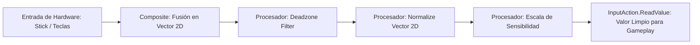

# 🕹️ Procesadores y Composites en Prowl Engine

Los datos brutos capturados directamente de los periféricos físicos rara vez están listos para aplicarse al movimiento de un personaje o al apuntado de una cámara:
- Los sticks analógicos de los mandos sufren de **Stick Drift** (pequeños valores no deseados cuando la palanca está en reposo).
- El movimiento diagonal con teclado (`W` + `D`) produce un vector de longitud $\sqrt{1^2 + 1^2} \approx 1.414$, provocando que el personaje se mueva un 41% más rápido en diagonal si no se normaliza.
- La sensibilidad del ratón suele requerir inversión de eje Y o multiplicadores ajustables.

En Prowl Engine, estos problemas se resuelven mediante el pipeline de **Procesadores ([`IInputProcessor.cs`](file:///c:/Users/SaidR/Documents/GitHub/ProwlStar/Prowl.Runtime/InputManagement/IInputProcessor.cs))** y **Composites ([`InputComposites.cs`](file:///c:/Users/SaidR/Documents/GitHub/ProwlStar/Prowl.Runtime/InputManagement/InputComposites.cs))**.

---

## ⚙️ El Pipeline de Procesamiento de Entrada



---

## 🛠️ Procesadores Estándar Disponibles

### 1. `DeadzoneProcessor` (Zona Muerta)
Elimina la deriva involuntaria de los joysticks analógicos:
- **`Min` (Defecto: 0.125f):** Cualquier magnitud por debajo de este valor se corta a cero absoluto.
- **`Max` (Defecto: 0.925f):** Cualquier magnitud por encima de este valor se amplifica al 1.0f completo para garantizar que el jugador pueda alcanzar la velocidad máxima incluso con mandos desgastados.
- Remapea suavemente el rango intermedio para que no haya un salto brusco al salir de la zona muerta.

### 2. `NormalizeVector2Processor` (Normalización 2D)
Evita el truco del "movimiento diagonal rápido":
- Si la longitud del vector es mayor que 1.0 (como cuando se pulsan `W` y `D` simultáneamente), normaliza el vector a una longitud unitaria exacta de 1.0.
- Si el jugador mueve suavemente el stick analógico (por ejemplo, inclinándolo solo al 50%), preserva la magnitud fraccional para permitir caminar despacio.

### 3. `InvertProcessor` (Inversión de Ejes)
Invierte el signo del valor numérico:
- Esencial para opciones de accesibilidad en juegos de aviación o cámaras en tercera persona donde el jugador prefiere "Mirar Arriba = Mover Ratón Abajo".

### 4. `ScaleProcessor` (Sensibilidad Multiplicativa)
Multiplica el valor de entrada por un factor escalar (p. ej. sensibilidad del ratón o aceleración de cámara).

---

## 💻 Configuración de Procesadores en C#

Los procesadores pueden encadenarse tanto en las acciones como en bindings individuales:

```csharp
using Prowl.Runtime;
using Prowl.Runtime.InputManagement;
using Prowl.Vector;

public class CustomInputSetup : MonoBehaviour
{
    private InputActionMap _controls;
    private InputAction _lookAction;

    public override void Awake()
    {
        base.Awake();
        _controls = new InputActionMap("CameraLook");

        // 1. Crear acción para rotación de cámara
        _lookAction = _controls.AddAction("Look", InputActionType.Value, InputActionValueType.Float2);

        // 2. Vincular ratón con procesador de sensibilidad
        var mouseBinding = _lookAction.AddBinding("<Mouse>/delta");
        mouseBinding.AddProcessor(new ScaleVector2Processor(scaleX: 0.15f, scaleY: 0.15f));

        // 3. Vincular stick derecho con zona muerta y sensibilidad independiente
        var stickBinding = _lookAction.AddBinding("<Gamepad>/rightStick");
        stickBinding.AddProcessor(new DeadzoneProcessor(min: 0.15f, max: 0.95f));
        stickBinding.AddProcessor(new ScaleVector2Processor(scaleX: 120f, scaleY: 120f));
    }

    public override void OnEnable() => _controls.Enable();
    public override void OnDisable() => _controls.Disable();
}
```

---

## 🧪 Cómo Crear un Procesador de Entrada Personalizado

Puedes implementar [`IInputProcessor`](file:///c:/Users/SaidR/Documents/GitHub/ProwlStar/Prowl.Runtime/InputManagement/IInputProcessor.cs) para aplicar cualquier lógica matemática propia (por ejemplo, curvas de respuesta cuadráticas o filtros exponenciales):

```csharp
public class CubicCurveProcessor : IInputProcessor
{
    // Transforma una respuesta lineal en una curva cúbica suave (f(x) = x^3)
    public object Process(object value, InputAction action)
    {
        if (value is float f)
        {
            return f * f * f;
        }
        else if (value is Float2 v)
        {
            float len = v.magnitude;
            if (len < 0.001f) return Float2.Zero;
            float newLen = len * len * len;
            return v.normalized * newLen;
        }

        return value;
    }
}
```

---

## 🔗 Temas Relacionados
- Fundamentos de input: [[🎮 Arquitectura del Input System]].
- Gestión de bindings: [[🗺️ Input Action Maps y Bindings]].
- Controladores en primera persona: [[💻 Ejemplos de Control de Personajes]].
