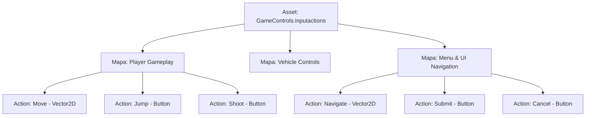

# 🗺️ Input Action Maps y Bindings en Prowl Engine

Un juego moderno raramente tiene un único esquema de controles. Un jugador a pie necesita caminar y saltar; al entrar en un coche necesita acelerar, frenar y girar; y al abrir el inventario o menú de pausa, las teclas deben navegar por botones en lugar de mover al personaje.

En Prowl Engine, esta segregación se resuelve mediante **Mapas de Acciones ([`InputActionMap`](file:///c:/Users/SaidR/Documents/GitHub/ProwlStar/Prowl.Runtime/InputManagement/InputActionMap.cs))** y **Asignaciones de Entrada ([`InputBinding`](file:///c:/Users/SaidR/Documents/GitHub/ProwlStar/Prowl.Runtime/InputManagement/InputBinding.cs))**, que pueden configurarse tanto en código como a través del editor dedicado de activos `.inputactions`.

---

## 📂 Organización en Mapas de Acciones



### Cambio de Contexto en Tiempo de Ejecución:
Cuando el jugador abre el menú de pausa:
```csharp
public class PauseManager : MonoBehaviour
{
    [SerializeField] private InputActionMap _playerMap;
    [SerializeField] private InputActionMap _uiMap;

    public void OpenPauseMenu()
    {
        // Desactiva los controles del personaje (deja de responder a WASD o disparos)
        _playerMap.Disable();

        // Activa la navegación de la interfaz
        _uiMap.Enable();

        // Desbloquear el cursor para interactuar con la pantalla
        Input.CursorLocked = false;
        Input.CursorVisible = true;
    }

    public void ClosePauseMenu()
    {
        _uiMap.Disable();
        _playerMap.Enable();
        Input.CursorLocked = true;
        Input.CursorVisible = false;
    }
}
```

---

## 🔗 Tipos de Bindings y Rutas de Dispositivo

Cada acción ([`InputAction`](file:///c:/Users/SaidR/Documents/GitHub/ProwlStar/Prowl.Runtime/InputManagement/InputAction.cs)) contiene uno o más bindings que vinculan hardware físico con la acción mediante cadenas de ruta estandarizadas:

| Dispositivo | Sintaxis de Ruta | Ejemplo |
| :--- | :--- | :--- |
| **Teclado** | `<Keyboard>/nombreTecla` | `<Keyboard>/space`, `<Keyboard>/w`, `<Keyboard>/leftShift` |
| **Ratón** | `<Mouse>/control` | `<Mouse>/leftButton`, `<Mouse>/rightButton`, `<Mouse>/delta` |
| **Gamepad** | `<Gamepad>/control` | `<Gamepad>/buttonSouth` (A/X), `<Gamepad>/leftStick`, `<Gamepad>/rightTrigger` |

---

## 🧩 Bindings Compuestos (Composite Bindings)

Un **Composite Binding** toma múltiples entradas discretas de hardware (por ejemplo, 4 teclas separadas) y las combina automáticamente en un único valor estructurado antes de entregarlo a tu código:

### 1. Vector 2D Composite (WASD o Flechas -> `Float2`)
Combina cuatro teclas o botones direccionales en un vector bidireccional continuo:
```csharp
InputAction moveAction = playerMap.AddAction("Move", InputActionType.Value, InputActionValueType.Float2);

// Vincular WASD
moveAction.AddCompositeBinding2D(
    up: "<Keyboard>/w",
    down: "<Keyboard>/s",
    left: "<Keyboard>/a",
    right: "<Keyboard>/d"
);

// Vincular adicionalmente el Stick Analógico de Mando al mismo evento
moveAction.AddBinding("<Gamepad>/leftStick");
```

### 2. 1D Axis Composite (Gatillos o Teclas -> `float`)
Combina dos botones en un eje escalar que va desde -1.0 a +1.0 (ideal para timones de avión, inclinación o zoom):
```csharp
InputAction zoomAction = playerMap.AddAction("Zoom", InputActionType.Value, InputActionValueType.Float);

zoomAction.AddCompositeBinding1D(
    negative: "<Keyboard>/q",
    positive: "<Keyboard>/e"
);
```

---

## 💾 Reasignación de Controles por el Usuario (Rebinding)

Permitir a los jugadores personalizar sus controles es una característica estándar que Prowl soporta de forma nativa:

```csharp
public class RebindUI : MonoBehaviour
{
    public void StartRebind(InputAction actionToRebind)
    {
        // 1. Pausar la acción temporalmente
        actionToRebind.Disable();

        // 2. Escuchar la siguiente pulsación de cualquier tecla
        Input.OnKeyEvent += (KeyCode pressedKey, bool isDown) =>
        {
            if (isDown)
            {
                // 3. Asignar la nueva tecla
                actionToRebind.ChangeBinding(0, $"<Keyboard>/{pressedKey.ToString().ToLower()}");

                // 4. Reactivar la acción
                actionToRebind.Enable();
            }
        };
    }
}
```

---

## 🔗 Temas Relacionados
- Arquitectura general: [[🎮 Arquitectura del Input System]].
- Procesamiento de deadzones y curvas: [[🕹️ Procesadores y Composites]].
- Ejemplos de uso en personajes: [[💻 Ejemplos de Control de Personajes]].
