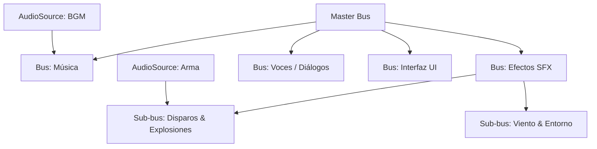

# 🎛️ AudioMixer y Snapshots en Prowl Engine

En un juego comercial, controlar el volumen de cada sonido de forma individual es insostenible. Se necesita una estructura de mezcla jerárquica para agrupar sonidos por categoría (Música, Diálogos, Efectos, Armas, Interfaz) y controlar su volumen, balance y efectos colectivamente.

Prowl Engine implementa un sistema profesional de mezcla a través de [`AudioMixer.cs`](file:///c:/Users/SaidR/Documents/GitHub/ProwlStar/Prowl.Runtime/Audio/AudioMixer.cs) e instantáneas de transición dinámica con [`AudioMixerSnapshot.cs`](file:///c:/Users/SaidR/Documents/GitHub/ProwlStar/Prowl.Runtime/Audio/AudioMixerSnapshot.cs).

---

## 🎚️ Jerarquía de Buses y Ruteo



### Características del Mezclador:
- **Atenuación en Decibelios (dB):** Los volúmenes se controlan en escala logarítmica estándar de audio:
  - $0 \text{ dB}$: Volumen nominal normal ($100\%$).
  - $-6 \text{ dB}$: Reducción de amplitud a la mitad ($50\%$).
  - $-80 \text{ dB}$: Silencio total (*Muted*).
- **Herencia de Volumen:** Reducir el volumen del `SFXBus` atenúa automáticamente todas sus fuentes secundarias (`WeaponsBus` y `AmbienceBus`) manteniendo sus proporciones relativas.
- **Cadenas de Efectos por Bus:** Puedes insertar un filtro pasa-bajos o una reverberación en el bus maestro para que afecte a todos los sonidos del juego a la vez.

---

## 📸 Snapshots: Transiciones de Escenarios de Audio

Un **Snapshot** captura un estado completo de todos los volúmenes y parámetros de efectos del `AudioMixer`.

### Casos de Uso Comunes:
1. **Menú de Pausa:** El snapshot `Paused` baja la música $-10 \text{ dB}$ y aplica un filtro de corte de agudos (*LowPass*) a los efectos SFX para desenfocar el sonido del juego mientras se navega por el menú.
2. **Bajo el Agua:** El snapshot `Underwater` ensordece los sonidos exteriores y activa un filtro de resonancia acuática.
3. **Salud Crítica / Conmoción:** Atenúa todo el audio excepto un pitido agudo de acúfeno (*Tinnitus*) y el latido del corazón del protagonista.

---

## 💻 Control de Mezclador y Snapshots en C#

```csharp
using Prowl.Runtime;
using Prowl.Runtime.Audio;

public class AudioSnapshotController : MonoBehaviour
{
    [SerializeField] private AudioMixer _mainMixer;
    [SerializeField] private AudioMixerSnapshot _normalSnapshot;
    [SerializeField] private AudioMixerSnapshot _underwaterSnapshot;
    [SerializeField] private AudioMixerSnapshot _pausedSnapshot;

    public void EnterWater()
    {
        // Transición suave hacia el snapshot subacuático en 0.75 segundos
        _underwaterSnapshot.TransitionTo(0.75f);
    }

    public void ExitWater()
    {
        // Restaurar estado normal en 0.5 segundos
        _normalSnapshot.TransitionTo(0.5f);
    }

    public void SetMusicVolumeSlider(float sliderValue01)
    {
        // Convertir valor lineal de UI (0.0001 a 1.0) a decibelios (-80dB a 0dB)
        float decibels = MathF.Log10(Math.Max(sliderValue01, 0.0001f)) * 20f;
        _mainMixer.SetFloat("MusicVolume", decibels);
    }
}
```

---

## 🦆 Audio Ducking (Atenuación Automática de Música)

El **Audio Ducking** es la técnica donde el volumen de la música ambiental se reduce temporal y automáticamente cuando un personaje habla por radio o ocurre una explosión estruendosa, asegurando que los diálogos siempre sean inteligibles:

```csharp
public class RadioDialogue : MonoBehaviour
{
    [SerializeField] private AudioMixer _mixer;

    public void StartRadioTransmission()
    {
        // Baja la música 12 decibelios instantáneamente
        _mixer.SetFloat("MusicVolume", -12f);
    }

    public void EndRadioTransmission()
    {
        // Restaura la música al volumen normal de 0 dB
        _mixer.SetFloat("MusicVolume", 0f);
    }
}
```

---

## 🔗 Temas Relacionados
- Motor MiniAudio: [[🔊 Motor de Audio y AudioContext]].
- Fuentes de sonido: [[🎧 AudioListener y AudioSource 3D]].
- Efectos de procesamiento: [[🧪 Efectos de Audio DSP]].
