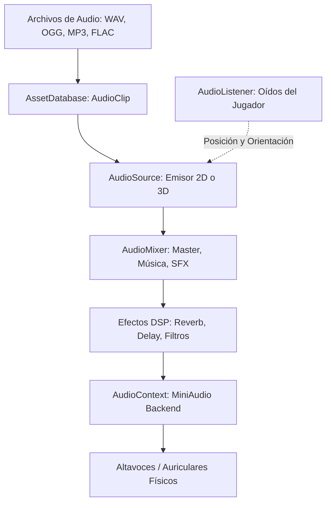

# 🔊 Motor de Audio y AudioContext en Prowl Engine

El motor de sonido de Prowl Engine está impulsado por un wrapper administrado sobre **MiniAudio**, una de las bibliotecas de audio nativo en C más veloces, portables y respetadas de la industria.

El punto central de control de bajo nivel del subsistema de sonido es [`AudioContext.cs`](file:///c:/Users/SaidR/Documents/GitHub/ProwlStar/Prowl.Runtime/Audio/AudioContext.cs), ubicado dentro del runtime.

---

## 🎧 Ventajas de la Integración con MiniAudio

1. **Soporte Multiplataforma Nativo:**
   Bibliotecas precompiladas para Windows (x64/x86), Linux (x64/ARM), macOS (Universal/Apple Silicon) y Android en la carpeta [`Libraries/`](file:///c:/Users/SaidR/Documents/GitHub/ProwlStar/Libraries).
2. **Decodificación de Formatos Universal sin Dependencias:**
   Soporte incorporado de decodificación en memoria o en streaming para:
   - **WAV:** Sonidos no comprimidos de latencia ultrabaja (impactos, disparos, pasos).
   - **OGG Vorbis:** Formato óptimo comprimido para efectos de sonido generales.
   - **MP3:** Compatibilidad universal para pistas musicales.
   - **FLAC:** Audio sin pérdida para bandas sonoras orquestales de alta definición.
3. **Baja Latencia y Cero Bloqueos del Hilo Principal:**
   El backend de audio corre en su propio hilo de alta prioridad del sistema operativo (*Audio Thread*), asegurando que una caída momentánea de framerate en la CPU de juego no cause chasquidos ni interrupciones sonoras.

---

## 🏗️ Arquitectura del Sistema de Audio



---

## 🎛️ Control Global mediante AudioContext

A través de `AudioContext` se puede controlar el dispositivo de salida maestro y el volumen global del juego:

```csharp
using Prowl.Runtime.Audio;

public class AudioManager : MonoBehaviour
{
    public void SetMasterVolume(float volume)
    {
        // Volumen maestro en escala lineal de 0.0f a 1.0f (o >1.0 para amplificación)
        AudioContext.MasterVolume = Math.Clamp(volume, 0.0f, 1.0f);
    }

    public void MuteAllAudio(bool mute)
    {
        AudioContext.IsMuted = mute;
    }

    public void SuspendAudio()
    {
        // Suspende el procesamiento al minimizar la ventana o pausar la aplicación
        AudioContext.Suspend();
    }

    public void ResumeAudio()
    {
        AudioContext.Resume();
    }
}
```

---

## ⚡ Streaming vs Carga en Memoria (AudioClip)

Al importar activos de audio en el proyecto:
- **Load In Memory (Decompress On Load):** El clip se descomprime por completo en la RAM. Recomendado para efectos cortos (< 5 segundos) que se reproducen docenas de veces por minuto (disparos, explosiones, monedas).
- **Streaming From Disk:** Solo se lee un pequeño búfer de pocos kilobytes a la vez. Obligatorio para pistas de música de fondo ambiental de larga duración y diálogos narrativos.

---

## 🔗 Temas Relacionados
- Emisores y receptores: [[🎧 AudioListener y AudioSource 3D]].
- Ruteo de canales y mezclas: [[🎛️ AudioMixer y Snapshots]].
- Procesamiento de efectos DSP: [[🧪 Efectos de Audio DSP]].
