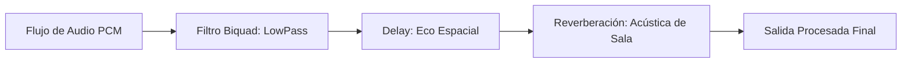

# 🧪 Efectos de Audio DSP en Prowl Engine

El procesamiento digital de señales de audio (**DSP - Digital Signal Processing**) permite transformar las ondas sonoras en tiempo real para simular acústica arquitectónica (catedrales, túneles, cuevas), efectos retro (radio vieja, walkie-talkie) o modificaciones espaciales.

En Prowl Engine, la arquitectura de efectos está construida sobre la interfaz unificada [`IAudioEffect`](file:///c:/Users/SaidR/Documents/GitHub/ProwlStar/Prowl.Runtime/Audio/Effects), permitiendo conectar cadenas de efectos modulares tanto a un [`AudioSource`](file:///c:/Users/SaidR/Documents/GitHub/ProwlStar/Prowl.Runtime/Components/Audio/AudioSource.cs) individual como a buses completos del [`AudioMixer`](file:///c:/Users/SaidR/Documents/GitHub/ProwlStar/Prowl.Runtime/Audio/AudioMixer.cs).

---

## 🎛️ Catálogo de Efectos DSP Nativos



### 1. `ReverbEffect` (Reverberación de Sala)
Simula el rebote difuso del sonido en las paredes y techos de un espacio cerrado:
- **`RoomSize` (0.0 a 1.0):** Tamaño aparente de la habitación (desde un armario pequeño hasta una catedral gótica).
- **`Damping` (0.0 a 1.0):** Absorción acústica de materiales blandos (alfombras, madera vs piedra y metal).
- **`WetMix` / `DryMix`:** Proporción entre la señal procesada con eco (*Wet*) y el sonido original puro (*Dry*).

### 2. `DelayEffect` (Eco Temporal)
Repite la señal de audio tras un intervalo de tiempo específico:
- **`DelayTime`:** Tiempo de retardo en milisegundos o segundos (p. ej. 0.3s).
- **`Feedback` (0.0 a 0.99):** Porcentaje de la señal repetida que vuelve a introducirse en el buffer de retardo (número de ecos consecutivos).

### 3. `BiquadFilterEffect` (Filtros de Frecuencia)
Filtro de segundo orden imprescindible para diseño sonoro:
- **`FilterType.LowPass`:** Corta las frecuencias agudas y deja pasar solo los graves. Esencial para simular sonidos que ocurren detrás de una pared gruesa o cuando el jugador se sumerge en agua.
- **`FilterType.HighPass`:** Elimina los graves y sub-bajos, dejando solo frecuencias chillonas. Utilizado para altavoces de megáfono o cascos de radio.
- **`CutoffFrequency`:** Frecuencia de corte en Hercios (20 Hz a 20,000 Hz).
- **`QFactor` (Resonancia):** Acentúa el pico de frecuencia en el punto de corte.

### 4. `DistortionEffect` (Saturación y Overdrive)
Aplica recorte no lineal de ondas (*Clipping*):
- Transforma sonidos limpios en señales saturadas, agresivas o industriales (armas futuristas, motores rotos, voces de robots).

---

## 💻 Configuración de Efectos DSP en C#

```csharp
using Prowl.Runtime;
using Prowl.Runtime.Audio;
using Prowl.Runtime.Audio.Effects;

public class ZoneAudioEffects : MonoBehaviour
{
    [SerializeField] private AudioSource _environmentalSource;

    public void ApplyCaveAcoustics()
    {
        // 1. Limpiar efectos existentes
        _environmentalSource.ClearEffects();

        // 2. Añadir Reverb de cueva
        var reverb = new ReverbEffect
        {
            RoomSize = 0.85f,
            Damping = 0.2f,
            WetMix = 0.45f,
            DryMix = 0.75f
        };
        _environmentalSource.AddEffect(reverb);

        // 3. Añadir Delay sutil
        var delay = new DelayEffect
        {
            DelayTime = 0.25f,
            Feedback = 0.35f,
            WetMix = 0.2f
        };
        _environmentalSource.AddEffect(delay);
    }
}
```

---

## 🧪 Creación de un Efecto DSP Personalizado

Puedes escribir tus propios algoritmos de procesamiento digital implementando `IAudioEffect` y procesando directamente los búferes de muestras PCM en coma flotante (`Span<float>`):

```csharp
public class TremoloEffect : IAudioEffect
{
    public float Frequency { get; set; } = 5.0f; // Oscilaciones por segundo
    public float Depth { get; set; } = 0.5f;

    private float _phase = 0.0f;

    public void Process(Span<float> buffer, int channels, int sampleRate)
    {
        float phaseIncrement = (MathF.PI * 2f * Frequency) / sampleRate;

        for (int i = 0; i < buffer.Length; i += channels)
        {
            float modulation = 1.0f - (Depth * (0.5f + 0.5f * MathF.Sin(_phase)));

            // Aplicar a todos los canales
            for (int c = 0; c < channels; c++)
            {
                buffer[i + c] *= modulation;
            }

            _phase += phaseIncrement;
            if (_phase > MathF.PI * 2f) _phase -= MathF.PI * 2f;
        }
    }
}
```

---

## 🔗 Temas Relacionados
- Arquitectura de sonido: [[🔊 Motor de Audio y AudioContext]].
- Fuentes espaciales: [[🎧 AudioListener y AudioSource 3D]].
- Buses de mezcla: [[🎛️ AudioMixer y Snapshots]].
