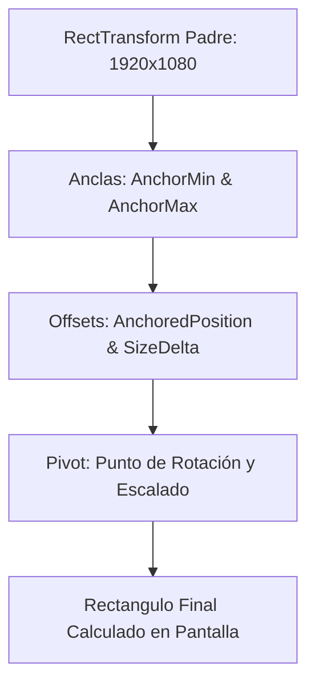

# 📐 RectTransform y Layouts en Prowl Engine

Mientras que los objetos 3D normales del juego utilizan un [`Transform`](file:///c:/Users/SaidR/Documents/GitHub/ProwlStar/Prowl.Runtime/Math/Transform.cs) para definir una posición tridimensional en el espacio, los elementos de interfaz requieren definir rectángulos bidimensionales adaptables que respondan a cambios de resolución y relación de aspecto.

En Prowl Engine, esto se implementa a través de [`RectTransform.cs`](file:///c:/Users/SaidR/Documents/GitHub/ProwlStar/Prowl.Runtime/Components/UI/RectTransform.cs) y la suite de componentes automáticos de distribución en [`Layout/`](file:///c:/Users/SaidR/Documents/GitHub/ProwlStar/Prowl.Runtime/Components/UI/Layout).

---

## 🎯 El Modelo de Anclas (Anchors) y Pivote (Pivot)



### 1. `Pivot` (Pivote de Referencia)
Vector 2D normalizado entre `(0, 0)` y `(1, 1)` que indica qué punto del propio rectángulo se utiliza como origen:
- `(0.5, 0.5)`: Centro exacto del elemento.
- `(0.0, 1.0)`: Esquina superior izquierda.
- `(1.0, 0.0)`: Esquina inferior derecha.

### 2. `AnchorMin` y `AnchorMax` (Anclas en el Padre)
Definen a qué parte del rectángulo padre está fijado el elemento:

#### Caso A: Ancla Puntual (`AnchorMin == AnchorMax`)
El elemento mantiene un tamaño fijo en píxeles (`SizeDelta`) y se posiciona relativo a un punto específico de la pantalla:
- **Minimapa en la esquina superior derecha:**
  `AnchorMin = Float2(1, 1)`, `AnchorMax = Float2(1, 1)`, `Pivot = Float2(1, 1)`.
- **Barra de vida centrada abajo:**
  `AnchorMin = Float2(0.5, 0)`, `AnchorMax = Float2(0.5, 0)`, `Pivot = Float2(0.5, 0)`.

#### Caso B: Ancla de Expansión / Stretch (`AnchorMin != AnchorMax`)
El elemento se expande elásticamente a medida que el padre cambia de tamaño:
- **Panel que llena toda la pantalla (Full Stretch):**
  `AnchorMin = Float2(0, 0)`, `AnchorMax = Float2(1, 1)`, `SizeDelta = Float2(0, 0)`.
- **Barra de navegación horizontal superior:**
  `AnchorMin = Float2(0, 1)`, `AnchorMax = Float2(1, 1)`. El ancho se expande al 100% de la pantalla mientras la altura permanece fija.

---

## 💻 Configuración de RectTransform en C#

```csharp
using Prowl.Runtime;
using Prowl.Runtime.UI;
using Prowl.Vector;

public class MinimapSetup : MonoBehaviour
{
    public override void Awake()
    {
        base.Awake();

        if (TryGetComponent<RectTransform>(out var rect))
        {
            // Anclar a la esquina superior derecha
            rect.AnchorMin = new Float2(1f, 1f);
            rect.AnchorMax = new Float2(1f, 1f);
            rect.Pivot = new Float2(1f, 1f);

            // Tamaño fijo de 200x200 píxeles
            rect.SizeDelta = new Float2(200f, 200f);

            // Margen de 20 píxeles hacia adentro de la pantalla
            rect.AnchoredPosition = new Float2(-20f, -20f);
        }
    }
}
```

---

## 🗂️ Componentes de Auto-Layout (Distribución Automática)

Para evitar posicionar manualmente cada botón o fila de inventario, Prowl ofrece controladores automáticos de diseño:

### 1. `VerticalLayoutGroup`
Organiza los elementos hijos en una columna vertical continua:
- **`Spacing`:** Espacio de separación en píxeles entre hijos consecutivos.
- **`Padding`:** Márgenes interiores (Left, Right, Top, Bottom).
- **`ChildForceExpand`:** Fuerza a los hijos a estirarse para rellenar el ancho o alto disponible.

### 2. `HorizontalLayoutGroup`
Organiza los elementos en una fila horizontal (ideal para barras de herramientas o listas de iconos de habilidades).

### 3. `GridLayoutGroup`
Distribuye los hijos en una cuadrícula bidimensional de filas y columnas uniformes:
- **`CellSize`:** Ancho y alto fijo de cada celda (p. ej. `Float2(64, 64)` para slots de inventario).
- **`Constraint`:** Forzar un número fijo de columnas (`FixedColumnCount`) o filas.

### 4. `ContentSizeFitter`
Redimensiona automáticamente el `RectTransform` padre para ajustarse al tamaño exacto de su contenido (por ejemplo, expandir la altura de una caja de diálogo para que encaje un texto largo).

---

## 🔗 Temas Relacionados
- Lienzo de interfaz: [[🖼️ Sistema UI para Juegos (GameCanvas)]].
- Controles interactivos: [[🔘 Componentes UI (Button, Slider, InputField, ScrollRect)]].
- Raycasting de UI: [[🖱️ EventSystem y UIRaycaster]].
