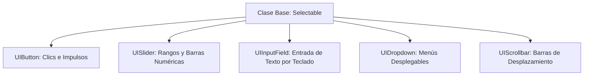

# 🔘 Componentes UI (Button, Slider, InputField, ScrollRect) en Prowl Engine

La construcción de interfaces funcionales en Prowl Engine se apoya en una biblioteca de componentes visuales e interactivos altamente desacoplados.

Todos los controles interactivos heredan de la clase base [`Selectable.cs`](file:///c:/Users/SaidR/Documents/GitHub/ProwlStar/Prowl.Runtime/Components/UI/Input/Selectable.cs), que proporciona una máquina de estados visuales uniforme (**Normal**, **Highlighted/Hover**, **Pressed**, **Selected**, **Disabled**), navegación por teclado o gamepad y transiciones de color suaves con [`ColorBlock`](file:///c:/Users/SaidR/Documents/GitHub/ProwlStar/Prowl.Runtime/Components/UI/Input/ColorBlock.cs).

---

## 🎨 1. Componentes Gráficos Base

### [`UIImage`](file:///c:/Users/SaidR/Documents/GitHub/ProwlStar/Prowl.Runtime/Components/UI/UIImage.cs)
Dibuja texturas o sprites 2D en el lienzo:
- **`Sprite`:** El activo gráfico a representar.
- **`Color`:** Tinte cromático y transparencia alfa.
- **Modos de Imagen:**
  - `Simple`: Estira la textura para cubrir el rectángulo.
  - `Sliced (9-Slice)`: Mantiene las esquinas con tamaño fijo y escala solo los bordes y el centro (esencial para ventanas y botones redondeados que no se deforman al redimensionarse).
  - `Filled`: Rellena la imagen porcentualmente de 0 a 1 (ideal para barras de vida circulares o radiales).

### [`TextComponent`](file:///c:/Users/SaidR/Documents/GitHub/ProwlStar/Prowl.Runtime/Components/UI/TextComponent.cs)
Renderizado de fuentes vectoriales de alta definición mediante [`UIFontSystem.cs`](file:///c:/Users/SaidR/Documents/GitHub/ProwlStar/Prowl.Runtime/Components/UI/UIFontSystem.cs):
- **`Text`:** Cadena de caracteres visible.
- **`FontSize`:** Tamaño de fuente en puntos.
- **`Alignment`:** Alineación horizontal y vertical (`TopLeft`, `Center`, `BottomRight`, etc.).
- **`RichText`:** Permite etiquetas de formato como `<b>negrita</b>`, `<i>cursiva</i>` y `<color=#FF0000>rojo</color>`.

---

## 🕹️ 2. Controles Interactivos Principales



### 1. [`UIButton`](file:///c:/Users/SaidR/Documents/GitHub/ProwlStar/Prowl.Runtime/Components/UI/Input/UIButton.cs)
Componente de botón interactivo:
- Evento `OnClick`: Despacha un evento cuando el usuario presiona y libera el botón.
- Soporta transiciones de color automáticas (`ColorBlock`).

### 2. [`UISlider`](file:///c:/Users/SaidR/Documents/GitHub/ProwlStar/Prowl.Runtime/Components/UI/Input/UISlider.cs)
Barra deslizante para valores numéricos continuos o enteros:
- **`MinValue` / `MaxValue`:** Límites numéricos del rango (p. ej. de 0 a 100).
- **`Value`:** Valor actual seleccionado.
- **`WholeNumbers`:** Si está activo, restringe la selección a números enteros.
- **`OnValueChanged`:** Callback disparado cada vez que el valor cambia.

### 3. [`UIInputField`](file:///c:/Users/SaidR/Documents/GitHub/ProwlStar/Prowl.Runtime/Components/UI/Input/UIInputField.cs)
Caja de texto interactiva para introducción de datos por el jugador:
- Soporte para cursor de texto parpadeante (*Caret*), selección de texto con ratón y pegado desde portapapeles.
- **`ContentType`:** Modos `Standard`, `IntegerNumber`, `DecimalNumber` o `Password` (enmascara los caracteres con asteriscos `***`).

### 4. [`UIScrollRect`](file:///c:/Users/SaidR/Documents/GitHub/ProwlStar/Prowl.Runtime/Components/UI/Input/UIScrollRect.cs)
Contenedor con desplazamiento para listas largas de elementos (inventarios, chats, árboles de diálogo):
- Soporta inercia física de arrastre con amortiguación elástica en los límites.
- Funciona en conjunto con [`RectMask.cs`](file:///c:/Users/SaidR/Documents/GitHub/ProwlStar/Prowl.Runtime/Components/UI/RectMask.cs) para recortar los elementos que salen del área visible.

---

## 💻 Ejemplo: Menú de Opciones con Botón y Slider en C#

```csharp
using Prowl.Runtime;
using Prowl.Runtime.UI;

public class SettingsMenuController : MonoBehaviour
{
    [SerializeField] private UIButton _applyButton;
    [SerializeField] private UISlider _volumeSlider;
    [SerializeField] private UIInputField _playerNameInput;

    public override void Awake()
    {
        base.Awake();

        // 1. Suscribirse al clic del botón mediante named method (Zero GC)
        if (_applyButton.IsValid())
        {
            _applyButton.OnClick += OnApplyClicked;
        }

        // 2. Escuchar cambios de valor en el slider
        if (_volumeSlider.IsValid())
        {
            _volumeSlider.OnValueChanged += OnVolumeChanged;
        }

        // 3. Escuchar envío de texto en el input field
        if (_playerNameInput.IsValid())
        {
            _playerNameInput.OnSubmit += OnPlayerNameSubmitted;
        }
    }

    private void OnApplyClicked()
    {
        Debug.Log("Configuración aplicada con éxito.");
    }

    private void OnVolumeChanged(float newVolume)
    {
        Debug.Log($"Nuevo volumen: {newVolume}");
    }

    private void OnPlayerNameSubmitted(string name)
    {
        Debug.Log($"Nombre de jugador actualizado: {name}");
    }
}
```

---

## 👻 Control de Visibilidad Global: CanvasGroup

El componente [`CanvasGroup`](file:///c:/Users/SaidR/Documents/GitHub/ProwlStar/Prowl.Runtime/Components/UI/CanvasGroup.cs) permite modificar propiedades de un panel entero y de todos sus hijos en una sola llamada:
- **`Alpha` (0.0f a 1.0f):** Desvanece suavemente un menú completo sin alterar los colores individuales de cada botón.
- **`Interactable` (bool):** Activa o desactiva la interacción de todos los botones hijos a la vez.
- **`BlocksRaycasts` (bool):** Permite que los clics del ratón atraviesen el panel cuando está oculto.

---

## 🔗 Temas Relacionados
- Arquitectura de lienzos: [[🖼️ Sistema UI para Juegos (GameCanvas)]].
- Sistema de layouts y anclas: [[📐 RectTransform y Layouts]].
- Despacho de eventos: [[🖱️ EventSystem y UIRaycaster]].
