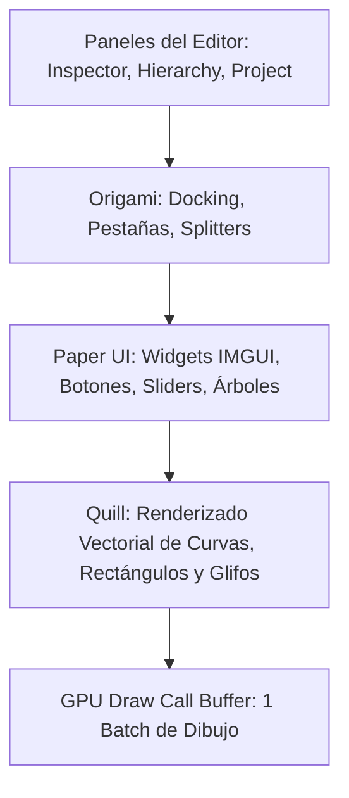

# 🖋️ UI Interna del Editor (Paper, Origami, Quill) en Prowl Engine

Mientras que los juegos construidos con Prowl utilizan un sistema de UI retenido basado en GameObjects y [`RectTransform`](file:///c:/Users/SaidR/Documents/GitHub/ProwlStar/Prowl.Runtime/Components/UI/RectTransform.cs), la interfaz visual del propio **Editor** ([`Prowl.Editor`](file:///c:/Users/SaidR/Documents/GitHub/ProwlStar/Prowl.Editor)) está construida sobre una pila tecnológica completamente distinta de tres bibliotecas especializadas:
1. **Paper UI:** Framework de interfaz en modo inmediato (*Immediate Mode GUI - IMGUI*) de altísimo rendimiento.
2. **Origami:** Sistema de acoplamiento (*Docking*), pestañas, paneles flotantes y persistencia de layouts.
3. **Quill:** Motor de renderizado vectorial antialiaseado y rasterización de fuentes.

---

## 🏛️ Pila Tecnológica de la UI del Editor



---

## 📄 1. Paper UI: Modo Inmediato Moderno en C#

A diferencia de las arquitecturas tradicionales donde debes instanciar y mantener referencias a objetos de botones en memoria, en el **Modo Inmediato (IMGUI)** defines la estructura y la lógica en una sola pasada por frame:

```csharp
// Estilo IMGUI en Paper UI: Declaración e interacción unificadas
if (Paper.Button("Compilar Scripts"))
{
    // Se ejecuta inmediatamente cuando el usuario hace clic
    CompileProjectScripts();
}

float newSpeed = Paper.SliderFloat("Velocidad", currentSpeed, 0f, 20f);
```

### ¿Por qué Modo Inmediato en el Editor?
- **Cero Sincronización de Estado:** Si una variable del juego cambia, el editor la refleja en el siguiente frame sin necesidad de eventos de refresco ni listeners.
- **Creación Ultrarrápida de Herramientas:** Crear un inspector personalizado requiere apenas unas pocas líneas de código procedural.
- **Cero Fugas de Memoria:** No hay objetos de interfaz persistentes huérfanos que deban ser destruidos manualmente.

---

## 🪟 2. Origami: Sistema de Docking y Paneles

[`Origami`](file:///c:/Users/SaidR/Documents/GitHub/ProwlStar/Prowl.Editor/GUI) administra la disposición espacial del editor de Prowl:
- **Acoplamiento Multidireccional:** Arrastra cualquier pestaña (Scene View, Inspector, Console) a los bordes superior, inferior, izquierdo o derecho de otra ventana para dividirla en paneles divididos (*Splitters*).
- **Pestañas Agrupadas:** Agrupa múltiples paneles en una misma ventana accesible por pestañas.
- **Ventanas Flotantes:** Desacopla paneles para ubicarlos en un segundo o tercer monitor.
- **Persistencia en Disco:** Las coordenadas y divisiones de la interfaz se guardan automáticamente en formato JSON al cerrar el editor y se restauran al iniciar.

---

## ✒️ 3. Quill: Gráficos Vectoriales y Tipografía Nítida

En interfaces complejas con curvas de animación, paletas de degradados o esquinas redondeadas, los motores tradicionales sufren de artefactos de pixelado al escalar o requieren múltiples texturas estáticas pesadas.

**Quill** es un rasterizador vectorial en GPU:
- **Curvas Matemáticas Bézier:** Dibuja líneas de conexiones de nodos, rejillas de animación y bordes redondeados con suavizado perfecto sin importar el nivel de zoom o la escala DPI del monitor.
- **Renderizado de Iconos SVG:** Todos los iconos de la interfaz de Prowl se renderizan vectorialmente en tiempo real desde vectores SVG, garantizando nitidez perfecta en pantallas 4K y 8K.
- **Generación Dinámica de Atlas de Fuentes:** Genera glifos vectoriales bajo demanda utilizando algoritmos SDF (*Signed Distance Field*).

---

## 💻 Creación de un Inspector Personalizado con Paper UI

```csharp
using Prowl.Editor;
using Prowl.PaperUI;
using Prowl.Runtime;

[CustomEditor(typeof(VehicleEngine))]
public class VehicleEngineEditor : CustomEditor
{
    public override void OnInspectorGUI()
    {
        VehicleEngine engine = (VehicleEngine)target;

        Paper.Text("Ajustes de Potencia del Motor", FontStyle.Bold);
        Paper.Separator();

        engine.Horsepower = Paper.SliderFloat("Caballos de Fuerza (HP)", engine.Horsepower, 50f, 1200f);
        engine.TurboBoost = Paper.Checkbox("Activar Turbo", engine.TurboBoost);

        if (engine.TurboBoost)
        {
            engine.BoostPressure = Paper.SliderFloat("Presión de Boost (Bar)", engine.BoostPressure, 0.5f, 3.5f);
        }

        if (Paper.Button("Probar Sonido de Motor"))
        {
            engine.PlayRevSound();
        }
    }
}
```

---

## 🔗 Temas Relacionados
- UI de juego: [[🖼️ Sistema UI para Juegos (GameCanvas)]].
- Extensibilidad del inspector: [[🎛️ Custom Editors e Inspector Personalizado]].
- Creación de paneles propios: [[🪟 Creación de Paneles Propios del Editor]].
