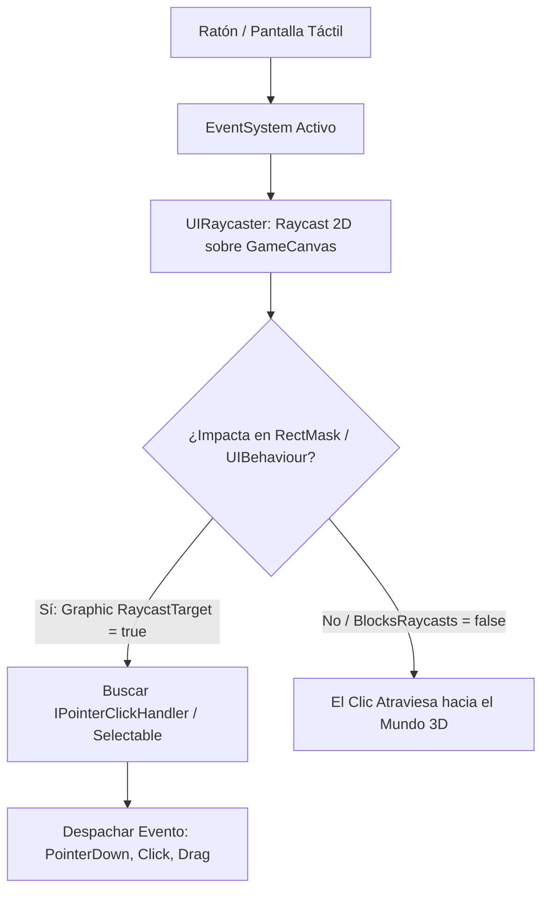

# 🖱️ EventSystem y UIRaycaster en Prowl Engine

Para que los botones, deslizadores y campos de texto respondan a clics del ratón, toques de pantalla o navegación con la cruceta de un mando, se requiere un despachador de eventos central y un sistema de sondeo de colisiones específico para interfaces.

En Prowl Engine, esta función la desempeñan [`EventSystem.cs`](file:///c:/Users/SaidR/Documents/GitHub/ProwlStar/Prowl.Runtime/Components/UI/Input/EventSystem.cs) y [`UIRaycaster.cs`](file:///c:/Users/SaidR/Documents/GitHub/ProwlStar/Prowl.Runtime/Components/UI/Input/UIRaycaster.cs).

---

## 🧭 Flujo de Detección y Despacho de Eventos



---

## 🎯 El Rol de UIRaycaster

[`UIRaycaster`](file:///c:/Users/SaidR/Documents/GitHub/ProwlStar/Prowl.Runtime/Components/UI/Input/UIRaycaster.cs) se adjunta a cada [`GameCanvas`](file:///c:/Users/SaidR/Documents/GitHub/ProwlStar/Prowl.Runtime/Components/GameCanvas.cs):
1. Convierte la posición del cursor de pantalla a coordenadas locales del lienzo.
2. Evalúa qué elementos gráficos ([`Graphic`](file:///c:/Users/SaidR/Documents/GitHub/ProwlStar/Prowl.Runtime/Components/UI/Graphic.cs), como `UIImage` o `TextComponent`) tienen activa la casilla `RaycastTarget = true`.
3. Respeta el orden de profundidad (*Z-order* o jerarquía): el elemento dibujado más al frente bloquea e intercepta el clic, evitando que los botones de atrás se activen accidentalmente.
4. Si un elemento está contenido dentro de un [`RectMask`](file:///c:/Users/SaidR/Documents/GitHub/ProwlStar/Prowl.Runtime/Components/UI/RectMask.cs) y se encuentra fuera de los límites de corte (como un ítem desplazado fuera del scroll), el raycast lo ignora automáticamente.

---

## 📦 Datos del Puntero: PointerEventData

Cuando ocurre una interacción, el sistema emite una instancia de [`PointerEventData`](file:///c:/Users/SaidR/Documents/GitHub/ProwlStar/Prowl.Runtime/Components/UI/Input/PointerEventData.cs) que contiene toda la información contextual del evento:
- **`Position` (`Float2`):** Posición actual del puntero en píxeles.
- **`Delta` (`Float2`):** Variación de movimiento relativo desde el último frame.
- **`Button` (`PointerEventData.InputButton`):** Botón pulsado (`Left`, `Right`, `Middle`).
- **`ClickCount` (`int`):** Número de clics rápidos consecutivos (detección de doble clic).
- **`Dragging` (`bool`):** Indica si el usuario está manteniendo presionado y arrastrando el cursor.

---

## 🕹️ Navegación por Gamepad y Teclado

Los juegos de consola o títulos con soporte para mando requieren navegar por la interfaz utilizando las flechas de dirección o el stick analógico sin necesidad de ratón:

El componente base [`Selectable`](file:///c:/Users/SaidR/Documents/GitHub/ProwlStar/Prowl.Runtime/Components/UI/Input/Selectable.cs) incluye un sistema de navegación inteligente ([`Navigation.cs`](file:///c:/Users/SaidR/Documents/GitHub/ProwlStar/Prowl.Runtime/Components/UI/Input/Navigation.cs)):

- **`NavigationMode.Automatic`:** Prowl analiza la posición en el espacio 2D de todos los botones vecinos y calcula automáticamente a cuál saltar cuando el jugador presiona `Arriba`, `Abajo`, `Izquierda` o `Derecha`.
- **`NavigationMode.Explicit`:** Permite definir a mano en el inspector exactamente qué botón se selecciona al moverse en cada dirección (ideal para disposiciones asimétricas o complejas).

---

## 💻 Implementación de Eventos Personalizados (Drag & Drop)

Puedes hacer que cualquier elemento de la interfaz sea arrastrable implementando las interfaces de eventos de Prowl:

```csharp
using Prowl.Runtime;
using Prowl.Runtime.UI;
using Prowl.Vector;

public class DraggableItem : MonoBehaviour, IBeginDragHandler, IDragHandler, IEndDragHandler
{
    private RectTransform _rect;
    private CanvasGroup _canvasGroup;

    public override void Awake()
    {
        base.Awake();
        TryGetComponent(out _rect);
        TryGetComponent(out _canvasGroup);
    }

    public void OnBeginDrag(PointerEventData eventData)
    {
        // Hacer semi-transparente y permitir que el ratón detecte la zona donde se suelta
        if (_canvasGroup.IsValid())
        {
            _canvasGroup.Alpha = 0.6f;
            _canvasGroup.BlocksRaycasts = false;
        }
    }

    public void OnDrag(PointerEventData eventData)
    {
        // Mover el elemento con el ratón
        _rect.AnchoredPosition += eventData.Delta;
    }

    public void OnEndDrag(PointerEventData eventData)
    {
        // Restaurar estado visual
        if (_canvasGroup.IsValid())
        {
            _canvasGroup.Alpha = 1.0f;
            _canvasGroup.BlocksRaycasts = true;
        }
    }
}
```

---

## 🔗 Temas Relacionados
- Lienzo raíz: [[🖼️ Sistema UI para Juegos (GameCanvas)]].
- Controles interactivos: [[🔘 Componentes UI (Button, Slider, InputField, ScrollRect)]].
- Sistema de entrada general: [[🎮 Arquitectura del Input System]].
