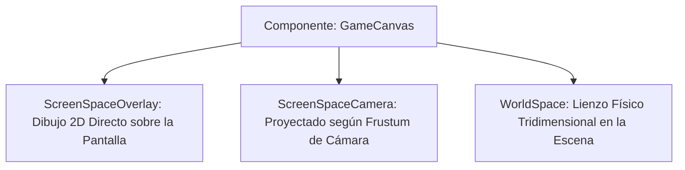

# 🖼️ Sistema UI para Juegos (GameCanvas) en Prowl Engine

La interfaz de usuario dentro del juego (HUDs de vida y munición, menús principales, barras de diálogo e interfaces holográficas en 3D) está gestionada por el componente raíz [`GameCanvas.cs`](file:///c:/Users/SaidR/Documents/GitHub/ProwlStar/Prowl.Runtime/Components/GameCanvas.cs).

A diferencia de la interfaz del Editor (que usa modo inmediato con Paper UI), la UI de juego en Prowl Engine sigue un paradigma retenido basado en **GameObjects**, jerarquías de [`RectTransform`](file:///c:/Users/SaidR/Documents/GitHub/ProwlStar/Prowl.Runtime/Components/UI/RectTransform.cs) y eventos desacoplados mediante [`EventSystem.cs`](file:///c:/Users/SaidR/Documents/GitHub/ProwlStar/Prowl.Runtime/Components/UI/Input/EventSystem.cs).

---

## 🖥️ Modos de Renderizado (`RenderMode`)

Un `GameCanvas` puede dibujarse en tres modos de proyección distintos:



### 1. `RenderMode.ScreenSpaceOverlay` (HUDs y Menús Estándar)
- El lienzo se ajusta automáticamente para llenar la resolución completa de la ventana del juego.
- Se renderiza por encima de toda la geometría 3D de la escena sin importar la posición de las cámaras.
- Es el modo estándar para menús principales, pantallas de carga, minimapas y contadores de vida.

### 2. `RenderMode.ScreenSpaceCamera`
- El lienzo se coloca a una distancia fija por delante de una cámara específica.
- Permite que efectos de post-procesamiento de la cámara o partículas 3D se dibujen por delante o por detrás de la interfaz.

### 3. `RenderMode.WorldSpace` (Interfaces Diegéticas / Hologramas)
- El canvas se comporta como cualquier otro objeto 3D del mundo.
- Su tamaño y orientación están determinados por su componente [`Transform`](file:///c:/Users/SaidR/Documents/GitHub/ProwlStar/Prowl.Runtime/Math/Transform.cs).
- Utilizado para pantallas de terminales de ordenador en el juego, barras de salud flotando sobre la cabeza de enemigos o carteles publicitarios interactivos.

---

## 📱 Modos de Escalado de Pantalla (`ScaleMode`)

Garantizar que una interfaz diseñada a `1920x1080` se vea nítida y proporcionada tanto en pantallas de teléfonos móviles como en monitores ultra-panorámicos 4K requiere un sistema de escalado inteligente:

| Modo de Escala | Comportamiento | Uso Típico |
| :--- | :--- | :--- |
| **`ScaleWithScreenSize`** | Escala todos los elementos proporcionalmente a una resolución de referencia (`ReferenceResolution`). | **Recomendado para la gran mayoría de juegos.** |
| **`ConstantPixelSize`** | Los elementos mantienen su tamaño exacto en píxeles sin importar la resolución. | Herramientas técnicas o interfaces retro pixel-art. |
| **`ConstantPhysicalSize`**| Escala los elementos según los puntos por pulgada (DPI) de la pantalla. | Aplicaciones móviles táctiles. |

---

## 💻 Configuración de un Canvas en C#

```csharp
using Prowl.Runtime;
using Prowl.Runtime.UI;
using Prowl.Vector;

public class HUDInitializer : MonoBehaviour
{
    public override void Awake()
    {
        base.Awake();

        // 1. Crear el GameObject contenedor
        GameObject canvasGo = new GameObject("GameHUD");

        // 2. Adjuntar el GameCanvas
        GameCanvas canvas = canvasGo.AddComponent<GameCanvas>();
        canvas.RenderMode = RenderMode.ScreenSpaceOverlay;
        canvas.ScaleMode = ScaleMode.ScaleWithScreenSize;
        canvas.ReferenceResolution = new Float2(1920, 1080);
        canvas.ScreenMatchMode = ScreenMatchMode.MatchWidthOrHeight;
        canvas.MatchWidthOrHeight = 0.5f; // Equilibrio entre ancho y alto

        // 3. Crear el sistema de eventos si no existe
        if (FindObjectsOfType<EventSystem>().Length == 0)
        {
            GameObject eventSystemGo = new GameObject("EventSystem");
            eventSystemGo.AddComponent<EventSystem>();
        }
    }
}
```

---

## ⚡ El Árbol de Renderizado de UI (UIRaycaster y UIRenderTree)

Bajo el capó, `GameCanvas` no dibuja llamadas sueltas de GPU:
- Recorre los componentes visibles ([`UIBehaviour`](file:///c:/Users/SaidR/Documents/GitHub/ProwlStar/Prowl.Runtime/Components/UI/UIBehaviour.cs)) como imágenes y textos.
- Construye una malla unificada mediante [`UIMeshBuilder.cs`](file:///c:/Users/SaidR/Documents/GitHub/ProwlStar/Prowl.Runtime/Components/UI/UIMeshBuilder.cs).
- Agrupa quads que comparten textura y material en lotes continuos, reduciendo drásticamente las draw calls de la interfaz.

---

## 🔗 Temas Relacionados
- Posicionamiento y anclas: [[📐 RectTransform y Layouts]].
- Widgets interactivos: [[🔘 Componentes UI (Button, Slider, InputField, ScrollRect)]].
- Eventos de clic y navegación: [[🖱️ EventSystem y UIRaycaster]].
