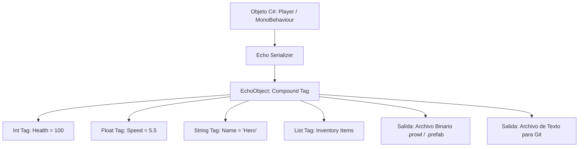

# 📜 Serialización con Prowl.Echo en Prowl Engine

La persistencia de escenas, prefabs, configuraciones de proyecto y el estado de los componentes en Prowl Engine no depende de JSON estándar ni del voluminoso formato YAML de Unity.

Prowl utiliza **Prowl.Echo**, un framework de serialización y clonación profunda de altísimo rendimiento diseñado específicamente para las exigencias de motores de videojuegos modernos.

---

## ⚡ ¿Por qué Prowl.Echo frente a YAML o JSON?

| Característica | Unity YAML | JSON Convencional | Prowl.Echo |
| :--- | :--- | :--- | :--- |
| **Velocidad de Carga** | Muy Lenta (parsing textual complejo). | Moderada (overhead de strings). | **Extrema (recorrido binario directo).** |
| **Tamaño de Escenas** | Masivo (múltiples megabytes por escena simple). | Moderado. | **Compacto (ahorro del 60% al 80%).** |
| **Control de Versiones (Git)**| Conflictos de merge casi imposibles de resolver. | Amigable. | **Formato Texto limpio y legible.** |
| **Clonación Profunda** | Requiere instanciación o hacks. | Lenta (serialize -> deserialize). | **Motor de clonación nativo en memoria.** |
| **Polimorfismo** | Soporte parcial con `$type`. | Requiere configuración manual. | **Soporte nativo de jerarquías de tipos.** |

---

## 🧱 El Modelo de Datos de Echo (EchoObject)

Echo serializa cualquier gráfico de objetos de C# en una estructura intermedia jerárquica basada en nodos denominada `EchoObject`:



### Modos de Formato Soportados:
1. **`EchoFormat.Binary`:** Serialización binaria empaquetada. Se utiliza en el juego final exportado (*Desktop Player*) para lograr tiempos de carga instantáneos sin parsing textual.
2. **`EchoFormat.Text`:** Representación en texto estructurado claro. Se utiliza en el proyecto del Editor para que los cambios en prefabs y escenas produzcan diffs limpios en Git.

---

## 🏷️ Atributos de Control de Serialización

Echo ofrece atributos para controlar con precisión milimétrica cómo se guardan y leen los datos:

```csharp
using Prowl.Echo;
using Prowl.Runtime;

public class CharacterData : MonoBehaviour
{
    // 1. Serializar campo privado (Recomendado por Encapsulación)
    [SerializeField]
    private int _maxHealth = 100;

    // 2. Ignorar campo que solo existe en tiempo de ejecución
    [SerializeIgnore]
    private float _currentShieldRechargeTimer;

    // 3. Serialización condicional (Solo se guarda si la propiedad booleana es true)
    [SerializeField]
    [SerializeIf(nameof(HasCustomGravity))]
    private float _customGravityScale = -9.81f;

    public bool HasCustomGravity => _customGravityScale != -9.81f;

    // 4. Migración de datos tras renombrar variables en C#
    [SerializeField]
    [FormerlySerializedAs("movementSpeed")]
    private float _speed = 10f;
}
```

---

## 🧬 Clonación Profunda Instantánea (`Serializer.Clone`)

Una de las capacidades más potentes de Echo es la clonación profunda en memoria sin pasar por disco:

```csharp
// Clonar profundamente un objeto completo con todos sus campos y listas anidadas
WeaponConfig clonedConfig = Serializer.Clone(originalConfig);
```
- A diferencia de `MemberwiseClone()`, Echo recorre todo el árbol de dependencias, creando copias independientes de arrays, listas y sub-objetos.
- Es utilizado internamente por el sistema de Prefabs y el sistema de **Undo/Redo** del Editor.

---

## 🔗 Temas Relacionados
- Base de datos de assets: [[🗄️ AssetDatabase y AssetRef]].
- Sistema de Prefabs: [[📦 Prefabs y Sistema de Overrides]].
- Configuración global del proyecto: [[⚙️ Project Settings y Tags-Layers]].
