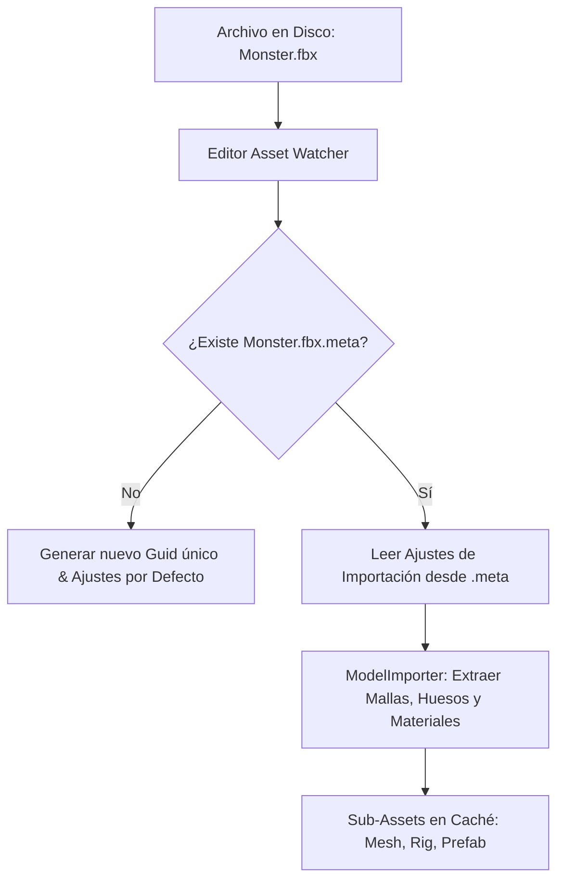

# 📥 Importadores de Assets (Modelos, Texturas, Audio) en Prowl Engine

Cuando añades un archivo externo (una textura PNG, un modelo 3D en FBX u OBJ, o una canción en OGG) a la carpeta de tu proyecto, el motor no puede enviarlo directamente a la GPU tal como está en el disco.

Prowl Engine procesa cada activo mediante su pipeline de **Importadores de Activos ([`AssetImporting`](file:///c:/Users/SaidR/Documents/GitHub/ProwlStar/Prowl.Runtime/AssetImporting))**, transformando los formatos de intercambio brutos en representaciones binarias optimizadas para la GPU y generando un archivo de metadatos `.meta`.

---

## 🔄 El Pipeline de Importación y Archivos `.meta`



### El Archivo `.meta`
Cada archivo dentro del proyecto tiene un archivo `.meta` hermano:
```yaml
Guid: 7f3a8b2c-4e1d-4890-a519-7c824e819b3f
Importer: ModelImporter
Settings:
  Scale: 1.0
  GenerateNormals: true
  GenerateTangents: true
  ImportAnimations: true
```
> [!IMPORTANT]
> **Nunca borres ni ignores los archivos `.meta` en Git.** Si borras el archivo `.meta`, Prowl generará un nuevo `Guid` aleatorio para el archivo, y todos los componentes que apuntaban a él perderán la referencia.

---

## 🧊 1. ModelImporter (Mallas 3D y Esqueletos)

Soporta formatos estándar de la industria como **FBX**, **OBJ**, **glTF** y **GLB**:

### Configuraciones Principales:
- **`Scale`:** Factor de escalado métrico (p. ej. 0.01 para convertir centímetros de Blender/Maya a metros de Prowl).
- **`GenerateTangents`:** Calcula vectores tangentes para habilitar el uso de mapas de normales (*Normal Mapping*) precisos.
- **`OptimizeMesh`:** Reordena los índices de los triángulos para maximizar el uso de la memoria caché de vértices (*Vertex Post-Transform Cache*) de la GPU.
- **`ImportBlendShapes`:** Extrae morph targets para animaciones faciales.
- **`BakePhysicsOnImport`:** Precalcula el árbol BVH de colisión en segundo plano.

---

## 🖼️ 2. TextureImporter (Mapas y Sprites)

Soporta **PNG**, **JPG**, **TGA**, **BMP**, **HDR** y **EXR**:

### Modos de Textura:
- **`TextureType.Default`:** Texturas estándar de color difuso o albedo (con corrección de espacio de color sRGB activada).
- **`TextureType.NormalMap`:** Mapeo de relieve en espacio tangente (desactiva sRGB para evitar distorsiones matemáticas en los vectores de normales).
- **`TextureType.Sprite`:** Texturas 2D destinadas a interfaces de usuario (`GameCanvas`) o juegos 2D.
- **`TextureType.Cubemap`:** Mapas cúbicos para fondos de cielo y reflejos ambientales.

### Ajustes de Filtrado y Compresión:
- **`FilterMode`:**
  - `Point`: Sin filtrado (esquinas nítidas de pixel-art).
  - `Bilinear`: Filtrado lineal suave entre píxeles vecinos.
  - `Trilinear`: Filtrado lineal combinado con transición suave entre niveles de Mipmaps.
- **`GenerateMipmaps`:** Genera versiones progresivamente más pequeñas de la textura para eliminar el parpadeo (*aliasing*) en superficies lejanas.

---

## 🎵 3. AudioImporter (Efectos y Música)

Soporta **WAV**, **OGG**, **MP3** y **FLAC**:

### Opciones de Ingestión:
- **`ForceToMono`:** Convierte audio estéreo a un solo canal monoaural (imprescindible para sonidos 3D con [`AudioSource`](file:///c:/Users/SaidR/Documents/GitHub/ProwlStar/Prowl.Runtime/Components/Audio/AudioSource.cs), ya que los archivos estéreo no se atenúan correctamente en el espacio tridimensional).
- **`Quality` (0 a 100):** Tasa de compresión OGG/MP3 para reducir el tamaño del juego final.
- **`LoadType`:** `DecompressOnLoad` (para efectos rápidos) o `Streaming` (para bandas sonoras).

---

## 🔗 Temas Relacionados
- Base de datos de assets: [[🗄️ AssetDatabase y AssetRef]].
- Materiales y texturas: [[🔮 Materiales, Shaders y PropertyState]].
- Audio espacial: [[🎧 AudioListener y AudioSource 3D]].
