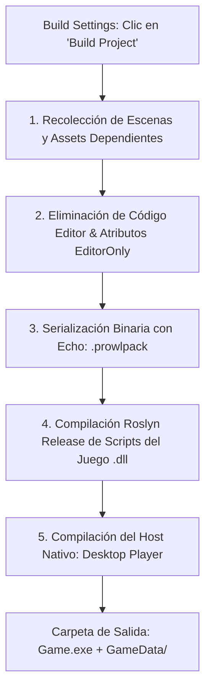

# 📦 Build System y Exportación Standalone (Desktop Player)

El objetivo final de cualquier desarrollo en Prowl Engine es exportar un ejecutable autónomo (*Standalone Game*) optimizado para su distribución comercial en plataformas como Steam, Epic Games Store, Itch.io o consolas.

El sistema de compilación de Prowl ([`Build/`](file:///c:/Users/SaidR/Documents/GitHub/ProwlStar/Prowl.Editor/Projects/Build)) y el host de distribución ([`Players/Desktop`](file:///c:/Users/SaidR/Documents/GitHub/ProwlStar/Players/Desktop)) empaquetan los activos, compilan los scripts C# del juego y generan un ejecutable nativo ultraligero que **no contiene ninguna dependencia de Prowl.Editor**.

---

## 🏗️ Flujo de Empaquetado y Exportación



---

## 🎛️ Configuración en Build Settings

Desde el menú **File -> Build Settings** ([`BuildSettingsPanel.cs`](file:///c:/Users/SaidR/Documents/GitHub/ProwlStar/Prowl.Editor/GUI/Panels/BuildSettingsPanel.cs)), se configuran los parámetros de publicación:

### 1. Escenas en la Compilación (Scenes In Build)
- Lista ordenada de escenas que se incluirán en el juego final.
- La escena situada en el **índice 0** es la escena de inicio (*Boot Scene*) que el motor cargará automáticamente al arrancar.

### 2. Plataformas de Destino (Target Platforms)
Prowl soporta exportación cruzada gracias al runtime multiplataforma de .NET 10 y las librerías nativas compiladas en `Libraries/`:
- **Windows:** Ejecutable `.exe` (x64 / x86).
- **Linux:** Binario ejecutable nativo ELF (x64 / ARM64).
- **macOS:** Aplicación `.app` bundle universal (Intel / Apple Silicon M1/M2/M3).

### 3. Modo de Empaquetado de Assets ([`AssetPackagingMode.cs`](file:///c:/Users/SaidR/Documents/GitHub/ProwlStar/Prowl.Runtime/AssetPackagingMode.cs))
- **`SinglePackage`:** Todos los modelos, texturas y sonidos se fusionan en un único archivo binario gigante comprimido.
- **`PerScenePackages`:** Cada escena tiene su propio archivo de paquete independiente, permitiendo pantallas de carga más rápidas y optimización de parches futuros (*DLCs*).

---

## ⚡ Anatomía de una Build Exportada

Una vez finalizado el proceso de compilación, la carpeta de distribución contiene una estructura limpia y auto-contenida:

```
MiJuego_Build/
├── MiJuego.exe                 # Ejecutable ligero de arranque (Players/Desktop)
├── Prowl.Runtime.dll           # Núcleo del motor sin código de editor
├── GameScripts.dll             # Ensamblado con tus MonoBehaviours compilados en Release
├── Libraries/                  # Librerías nativas mínimas (MiniAudio)
└── GameData/
    ├── Manifest.echo           # PlayerManifest con metadatos y lista de escenas
    ├── Settings.echo           # ProjectSettings compilados
    └── GameAssets.prowlpack    # Archivo binario con todos los recursos comprimidos
```

---

## 🚀 Optimización para Producción

1. **Stripping de Editor:**
   Todo código envuelto en `#if PROWL_EDITOR` o componentes de debug marcados con el tag `EditorOnly` se purgan automáticamente de la compilación, garantizando que tus herramientas privadas no se filtren a los usuarios finales.
2. **Optimizaciones de Compilación Release (.NET):**
   El código C# se compila con optimizaciones completas del JIT, inlining de métodos pequeños y eliminación de comprobaciones de límites redundantes en bucles vectoriales.
3. **Cero Búsqueda en Disco:**
   Al usar [`PlayerAssetBackend.cs`](file:///c:/Users/SaidR/Documents/GitHub/ProwlStar/Prowl.Runtime/PlayerAssetBackend.cs), el motor busca los assets directamente por offsets binarios en el archivo de paquete, eliminando la latencia de explorar carpetas del sistema de archivos.

---

## 🔗 Temas Relacionados
- Arquitectura desacoplada: [[⚡ Arquitectura General (Runtime vs Editor)]].
- Base de datos en producción: [[🗄️ AssetDatabase y AssetRef]].
- Serialización binaria: [[📜 Serialización con Prowl.Echo]].
