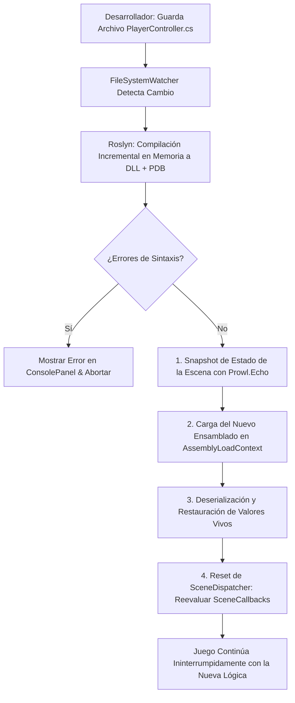

# ⚡ Roslyn Hot Reload y Compilación en Caliente en Prowl Engine

En el desarrollo de videojuegos moderno, reiniciar el motor o esperar 30 segundos cada vez que cambias una sola línea de código en un script destruye por completo el flujo de trabajo (*Flow State*) del programador.

Prowl Engine incorpora un sistema de **Recarga en Caliente (Hot Reload)** basado en **Microsoft.CodeAnalysis (Roslyn)** gestionado por [`RoslynScriptBackend.cs`](file:///c:/Users/SaidR/Documents/GitHub/ProwlStar/Prowl.Editor/Projects/Scripting/RoslynScriptBackend.cs) y [`SceneHotReload.cs`](file:///c:/Users/SaidR/Documents/GitHub/ProwlStar/Prowl.Editor/Projects/Scripting/SceneHotReload.cs), permitiendo modificar la lógica de cualquier script C# y ver los cambios reflejados **en menos de un segundo sin reiniciar el Editor ni perder el estado de la escena en juego**.

---

## 🔄 El Pipeline de Hot Reload Paso a Paso

---

## 🧩 Fases Internas en Detalle

### 1. Detección y Compilación Incremental
- Un `FileSystemWatcher` vigila la carpeta `Scripts/` del proyecto.
- En cuanto se guarda un archivo `.cs`, el backend invoca el compilador C# de Roslyn en memoria.
- Produce un ensamblado binario y símbolos de depuración (`PDB`) en cuestión de milisegundos, reportando diagnósticos o advertencias en la consola del editor.

### 2. Captura del Estado de Escena con Prowl.Echo ([`SceneHotReload.cs`](file:///c:/Users/SaidR/Documents/GitHub/ProwlStar/Prowl.Editor/Projects/Scripting/SceneHotReload.cs))
- Para evitar que los enemigos se reinicien o el jugador pierda su posición actual en el mundo, el motor utiliza **Prowl.Echo** para capturar una copia serializada profunda de todos los campos vivos de cada `MonoBehaviour`.

### 3. Intercambio de Ensamblados (Assembly Swap)
- Se carga el nuevo ensamblado en un contexto de carga independiente (`AssemblyLoadContext`).
- Las referencias de componentes en el grafo de objetos se migran en caliente hacia las nuevas definiciones de clase.

### 4. Restauración de Estado y Reset de SceneDispatcher
- Los valores serializados se vuelcan de nuevo en las instancias de los nuevos tipos.
- El despachador de escenas ([`SceneDispatcher.cs`](file:///c:/Users/SaidR/Documents/GitHub/ProwlStar/Prowl.Runtime/GameObject/SceneDispatcher.cs)) invalida su caché estática de tipos (`Reset()`):
  - Si en la nueva versión de tu script agregaste por primera vez `public override void Update()`, el despachador lo detecta inmediatamente y comienza a invocarlo en el siguiente frame.
  - Si eliminaste un método o callback, el despachador retira la bandera binaria correspondiente (`SceneCallbacks`), garantizando cero llamadas vacías.

---

## 🛡️ Reglas para un Hot Reload Impecable

Para que tus scripts se recarguen limpiamente sin pérdida de datos:

1. **Mantén los Campos Importantes Serializables:**
   Cualquier variable de juego que deba sobrevivir a la recarga en caliente debe llevar `[SerializeField]`.
2. **Campos con `[SerializeIgnore]`:**
   Los campos marcados como ignorados volverán a su valor inicial por defecto tras una recarga en caliente.
3. **Evita Hilos Nativos Desconectados:**
   Si abres hilos de fondo directos del sistema operativo (`new Thread()`), asegúrate de cancelarlos en `OnDisable()` para que no continúen ejecutando código del ensamblado antiguo descargado.

---

## 🔗 Temas Relacionados
- Ciclo de vida y despacho: [[⏱️ Ciclo de Vida y Game Loop]].
- Serialización profunda: [[📜 Serialización con Prowl.Echo]].
- Arquitectura del editor: [[🛠️ Arquitectura de Prowl.Editor]].
