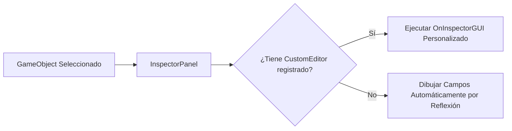

# 🎛️ Custom Editors e Inspector Personalizado en Prowl Engine

Por defecto, Prowl Engine inspecciona y dibuja automáticamente todos los campos serializados (`[SerializeField]`) de cualquier [`MonoBehaviour`](file:///c:/Users/SaidR/Documents/GitHub/ProwlStar/Prowl.Runtime/GameObject/MonoBehaviour.cs) en el [`InspectorPanel`](file:///c:/Users/SaidR/Documents/GitHub/ProwlStar/Prowl.Editor/GUI/Panels/InspectorPanel.cs).

Sin embargo, para crear herramientas de diseño de niveles eficientes, validadores de datos o interfaces avanzadas para diseñadores (como botones de prueba, selectores visuales o advertencias dinámicas), puedes crear un **Custom Editor** heredando de [`CustomEditor.cs`](file:///c:/Users/SaidR/Documents/GitHub/ProwlStar/Prowl.Editor/GUI/CustomEditor.cs).

---

## 🏗️ La Clase Base CustomEditor

Para asociar un inspector personalizado a un componente de juego:
1. Decora la clase con el atributo `[CustomEditor(typeof(ComponenteObjetivo))]`.
2. Sobrescribe el método `public override void OnInspectorGUI()`.
3. Utiliza los widgets de **Paper UI** y **EditorGUI** para dibujar controles y botones.



---

## 💻 Ejemplo Completo: Inspector Personalizado con Botones y Alertas

Supongamos que tenemos un componente de juego para generar mazmorras procedurales:

### El Componente de Juego (`Prowl.Runtime`):
```csharp
using Prowl.Runtime;
using Prowl.Vector;

public class DungeonGenerator : MonoBehaviour
{
    [SerializeField] private int _roomCount = 10;
    [SerializeField] private float _roomSpacing = 15f;
    [SerializeField] private bool _generateEnemies = true;

    public int RoomCount { get => _roomCount; set => _roomCount = value; }
    public float RoomSpacing { get => _roomSpacing; set => _roomSpacing = value; }
    public bool GenerateEnemies { get => _generateEnemies; set => _generateEnemies = value; }

    public void GenerateDungeon()
    {
        Debug.Log($"Generando mazmorra con {_roomCount} habitaciones...");
        // Lógica de generación procedural
    }

    public void ClearDungeon()
    {
        Debug.Log("Mazmorra limpiada.");
    }
}
```

### El Custom Editor (`Prowl.Editor`):
```csharp
#if PROWL_EDITOR
using Prowl.Editor;
using Prowl.PaperUI;
using Prowl.Runtime;

[CustomEditor(typeof(DungeonGenerator))]
public class DungeonGeneratorEditor : CustomEditor
{
    public override void OnInspectorGUI()
    {
        // 1. Obtener la referencia al componente inspeccionado
        DungeonGenerator generator = (DungeonGenerator)target;

        Paper.Text("Herramienta de Generación Procedural", FontStyle.Bold);
        Paper.Separator();

        // 2. Dibujar campos interactivos con validaciones
        generator.RoomCount = Paper.SliderInt("Número de Habitaciones", generator.RoomCount, 1, 100);
        generator.RoomSpacing = Paper.SliderFloat("Separación entre Salas", generator.RoomSpacing, 5f, 50f);
        generator.GenerateEnemies = Paper.Checkbox("Generar Enemigos", generator.GenerateEnemies);

        // 3. Mostrar advertencia condicional si los parámetros son extremos
        if (generator.RoomCount > 50)
        {
            Paper.PushColor(PaperColor.Text, new Color(1f, 0.7f, 0.2f, 1f));
            Paper.Text("⚠️ Advertencia: Más de 50 salas puede aumentar el tiempo de generación.");
            Paper.PopColor();
        }

        Paper.Spacing(8);

        // 4. Botones de acción directa dentro del Editor
        if (Paper.Button("🎲 Generar Mazmorra Ahora"))
        {
            generator.GenerateDungeon();
        }

        if (Paper.Button("🗑️ Limpiar Mazmorra"))
        {
            generator.ClearDungeon();
        }
    }
}
#endif
```

---

## 🎨 Utilidades de EditorGUI y Paper UI

Al diseñar inspectores, dispones de una amplia variedad de widgets de modo inmediato:

- `Paper.Text("Label")`: Dibuja texto simple o con estilos.
- `Paper.Button("Texto")`: Botón interactivo que devuelve `true` en el frame en que se hace clic.
- `Paper.SliderFloat("Nombre", valor, min, max)`: Barra deslizante numérica.
- `Paper.Checkbox("Activar", boolValue)`: Casilla de verificación booleana.
- `Paper.ColorPicker("Color", colorValue)`: Selector visual cromático con soporte HDR y rueda de tono.
- `Paper.Separator()`: Línea divisoria horizontal decorativa.
- `Paper.PushID("UniqueKey")` / `Paper.PopID()`: Aísla el scope de IDs para evitar conflictos de interacción entre listas de elementos idénticos.

---

## 🔗 Temas Relacionados
- Arquitectura del editor: [[🛠️ Arquitectura de Prowl.Editor]].
- Herramientas visuales en 3D: [[🪄 Scene View Editors y Gizmos]].
- Creación de paneles flotantes: [[🪟 Creación de Paneles Propios del Editor]].
