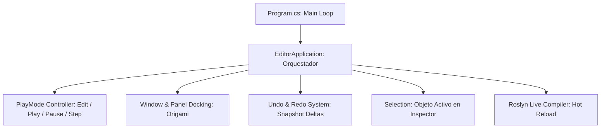

# 🛠️ Arquitectura de Prowl.Editor en Prowl Engine

[`Prowl.Editor`](file:///c:/Users/SaidR/Documents/GitHub/ProwlStar/Prowl.Editor) es el entorno visual de desarrollo integrado (IDE) para crear, editar, depurar y probar proyectos en tiempo real.

Está diseñado con una filosofía de **cero reinicios**: los scripts se compilan en caliente mientras el motor está abierto, las escenas pueden guardarse y revertirse instantáneamente, y el cambio entre modo edición y modo juego (*PlayMode*) ocurre en milisegundos sin recargar la aplicación completa.

---

## 🏛️ Núcleo Central: EditorApplication

El corazón del entorno de herramientas es [`EditorApplication.cs`](file:///c:/Users/SaidR/Documents/GitHub/ProwlStar/Prowl.Editor/Core/EditorApplication.cs):

### Estados de Ejecución:
- **Edit Mode (Modo Edición):**
  La física de juego y los métodos `Update()` normales están en pausa (a menos que un script tenga el atributo `[ExecuteAlways]`). Las cámaras del editor permiten volar y navegar libremente por el mundo, y los gizmos de transformación permiten mover entidades con el ratón.
- **Play Mode (Modo Juego):**
  Se crea una copia temporal en memoria de la escena activa. La física de Jitter 2, el audio y los bucles de juego cobran vida exactamente como ocurrirá en el juego compilado final.
- **Pause & Step:**
  Permite congelar la simulación en cualquier momento y avanzar fotograma a fotograma para depurar interacciones físicas o colisiones complejas.

---

## ↩️ Sistema de Undo / Redo

Prowl implementa un sistema transaccional de deshacer/rehacer a prueba de fallos ([`Undo.cs`](file:///c:/Users/SaidR/Documents/GitHub/ProwlStar/Prowl.Editor/Core/Undo.cs)):
- Antes de modificar un valor en el Inspector o mover un objeto con un gizmo, el editor registra una instantánea diferencial del estado mediante **Prowl.Echo**.
- Presionar `Ctrl + Z` restaura el estado anterior sin provocar desincronizaciones ni corrupciones de punteros en C#.
- Soporta creación de objetos, borrado, reparenting de jerarquías y cambios numéricos en masa.

---

## 📋 Selección y Portapapeles (Selection & Clipboard)

- **[`Selection.cs`](file:///c:/Users/SaidR/Documents/GitHub/ProwlStar/Prowl.Editor/Core/Selection.cs):** Rastrea globalmente qué `GameObject`, archivo de asset o componente tiene el foco activo del usuario. Todos los paneles (Hierarchy, Project, Inspector) se sincronizan automáticamente a través de este canal de selección.
- **[`GameObjectClipboard.cs`](file:///c:/Users/SaidR/Documents/GitHub/ProwlStar/Prowl.Editor/Core/GameObjectClipboard.cs) y [`ComponentClipboard.cs`](file:///c:/Users/SaidR/Documents/GitHub/ProwlStar/Prowl.Editor/Core/ComponentClipboard.cs):** Permiten copiar y pegar entidades completas o componentes individuales (incluyendo la opción *"Paste Component Values"* para transferir configuraciones entre objetos distintos).

---

## 🪟 Paneles Principales del Editor

| Panel | Archivo Fuente | Responsabilidad |
| :--- | :--- | :--- |
| **Hierarchy** | [`HierarchyPanel.cs`](file:///c:/Users/SaidR/Documents/GitHub/ProwlStar/Prowl.Editor/GUI/Panels/HierarchyPanel.cs) | Grafo de la escena activa con soporte para arrastrar y jerarquizar. |
| **Inspector** | [`InspectorPanel.cs`](file:///c:/Users/SaidR/Documents/GitHub/ProwlStar/Prowl.Editor/GUI/Panels/InspectorPanel.cs) | Visualización y edición de campos mediante `CustomEditor`. |
| **Scene View** | [`SceneViewPanel.cs`](file:///c:/Users/SaidR/Documents/GitHub/ProwlStar/Prowl.Editor/GUI/Panels/SceneViewPanel.cs) | Vista 3D interactiva con gizmos de traslación, rotación y escala. |
| **Game View** | [`GameViewPanel.cs`](file:///c:/Users/SaidR/Documents/GitHub/ProwlStar/Prowl.Editor/GUI/Panels/GameViewPanel.cs) | Ventana que muestra la perspectiva de la cámara del jugador en tiempo real. |
| **Project** | [`ProjectPanel.cs`](file:///c:/Users/SaidR/Documents/GitHub/ProwlStar/Prowl.Editor/GUI/Panels/ProjectPanel.cs) | Explorador del sistema de archivos de assets con miniaturas e importación. |
| **Console** | [`ConsolePanel.cs`](file:///c:/Users/SaidR/Documents/GitHub/ProwlStar/Prowl.Editor/GUI/Panels/ConsolePanel.cs) | Consola interactiva para depuración de `Debug.Log`, advertencias y errores. |

---

## 🔗 Temas Relacionados
- Personalización del inspector: [[🎛️ Custom Editors e Inspector Personalizado]].
- Gizmos y herramientas visuales: [[🪄 Scene View Editors y Gizmos]].
- Compilación instantánea: [[⚡ Roslyn Hot Reload y Compilación en Caliente]].
