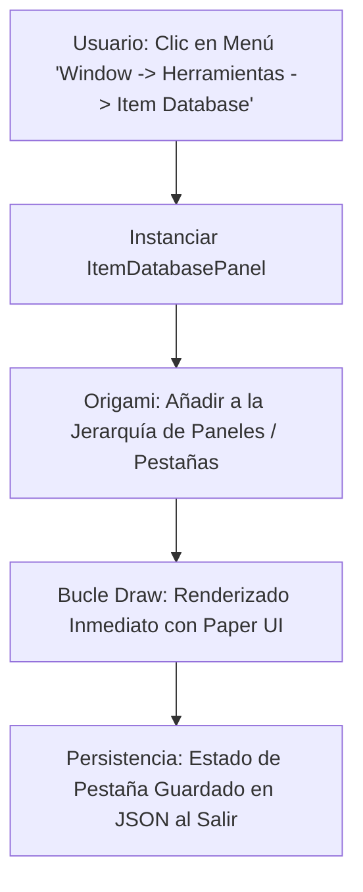

# 🪟 Creación de Paneles Propios del Editor en Prowl Engine

Para herramientas de producción que van más allá de un inspector de componentes específico (por ejemplo: un gestor de misiones, un visor de base de datos de objetos, un generador de árboles o una consola de comandos de desarrollador), Prowl Engine permite crear **Paneles de Editor Personalizados** acoplables.

Estos paneles se integran de forma transparente con el sistema de acoplamiento (*Docking*) de **Origami**, pueden guardarse en la disposición de ventanas del usuario y se renderizan a máxima velocidad con **Paper UI**.

---

## 🏗️ La Estructura de un Panel del Editor

Para crear un panel propio:
1. Crea una clase que herede de `EditorPanel` (dentro de un ensamblado de Editor o protegido con `#if PROWL_EDITOR`).
2. Registra un elemento en la barra de menú superior usando el atributo `[MenuItem("Categoría/Nombre")]`.
3. Sobrescribe el método `Draw()` para dibujar la interfaz con Paper UI.



---

## 💻 Ejemplo Completo: Gestor de Base de Datos de Ítems (Item Database Tool)

```csharp
#if PROWL_EDITOR
using System.Collections.Generic;
using Prowl.Editor;
using Prowl.PaperUI;
using Prowl.Runtime;
using Prowl.Vector;

public class ItemDatabasePanel : EditorPanel
{
    // 1. Título visible en la pestaña del panel
    public override string Title => "📦 Gestor de Ítems";

    // 2. Registrar en la barra de menú superior
    [MenuItem("Window/Herramientas/Gestor de Ítems")]
    public static void OpenPanel()
    {
        EditorApplication.Instance.OpenPanel<ItemDatabasePanel>();
    }

    private string _searchFilter = "";
    private int _selectedItemIndex = -1;

    private readonly List<string> _dummyItems = new()
    {
        "Espada de Hierro",
        "Poción de Curación",
        "Escudo de Madera",
        "Arco Élfico",
        "Armadura de Placas"
    };

    // 3. Dibujar la interfaz del panel
    public override void Draw()
    {
        Paper.Text("Base de Datos Global de Ítems", FontStyle.Bold);
        Paper.Separator();

        // Barra de búsqueda rápida
        _searchFilter = Paper.InputField("Buscar:", _searchFilter);
        Paper.Spacing(4);

        // Layout dividido en dos columnas: Lista a la izquierda, Detalles a la derecha
        Paper.BeginColumns(2);

        // --- COLUMNA 1: Lista de Ítems ---
        Paper.SetColumnWidth(0, 220f);
        Paper.Text("Inventario Maestro:");

        for (int i = 0; i < _dummyItems.Count; i++)
        {
            string item = _dummyItems[i];
            if (!string.IsNullOrEmpty(_searchFilter) && !item.Contains(_searchFilter, System.StringComparison.OrdinalIgnoreCase))
                continue;

            bool isSelected = (_selectedItemIndex == i);
            if (Paper.Selectable(item, isSelected))
            {
                _selectedItemIndex = i;
            }
        }

        Paper.NextColumn();

        // --- COLUMNA 2: Detalles del Ítem Seleccionado ---
        if (_selectedItemIndex >= 0 && _selectedItemIndex < _dummyItems.Count)
        {
            Paper.Text($"Detalles: {_dummyItems[_selectedItemIndex]}", FontStyle.Bold);
            Paper.Separator();

            Paper.Text("Propiedades de Juego:");
            Paper.SliderInt("Valor en Oro", 150, 1, 5000);
            Paper.SliderFloat("Peso (kg)", 3.5f, 0.1f, 50f);

            if (Paper.Button("Crear Prefab en la Escena"))
            {
                Debug.Log($"Instanciando prefab de {_dummyItems[_selectedItemIndex]} en la escena...");
            }
        }
        else
        {
            Paper.Text("Selecciona un ítem de la lista para ver o editar sus atributos.");
        }

        Paper.EndColumns();
    }
}
#endif
```

---

## 🎛️ Métodos de Ciclo de Vida de EditorPanel

Un `EditorPanel` proporciona puntos de enganche adicionales para inicializar y liberar recursos:

- **`OnEnable()`:** Se llama cuando la ventana se abre por primera vez o se restaura al iniciar el editor. Ideal para suscribirse a eventos globales o cargar datos de disco.
- **`OnDisable()`:** Se ejecuta cuando el usuario cierra la pestaña o sale de la aplicación.
- **`Update()`:** Se ejecuta en cada frame independientemente de si el panel está visible en pantalla (útil para comprobaciones en segundo plano).
- **`Draw()`:** El bucle principal de renderizado donde se ejecutan los widgets de Paper UI.

---

## 🔗 Temas Relacionados
- Arquitectura del editor: [[🛠️ Arquitectura de Prowl.Editor]].
- Sistema de ventanas Origami: [[🖋️ UI Interna del Editor (Paper, Origami, Quill)]].
- Inspectores personalizados: [[🎛️ Custom Editors e Inspector Personalizado]].
